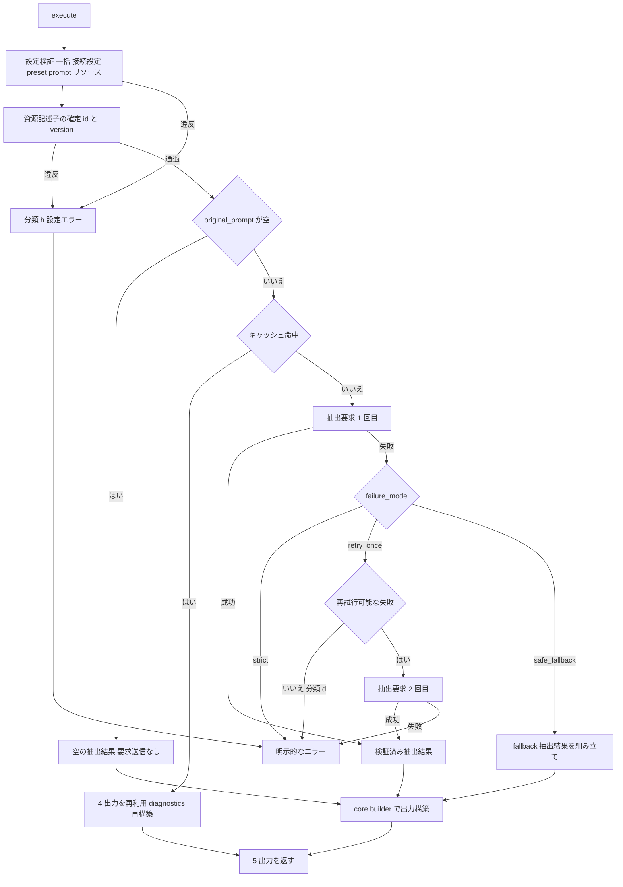
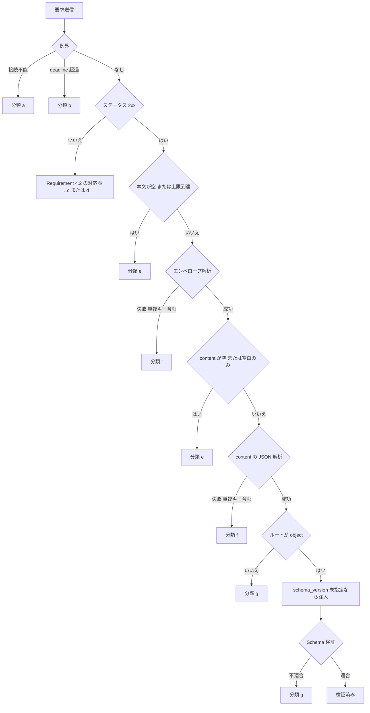

# Technical Design: ollama-prompt-analyzer

## Overview

**Purpose**: 本 spec は `ComfyUI-Prompt-Detailer-Router` の唯一の LLM 接点である `PDR_OllamaPromptAnalyzer` ノードを実装する。元プロンプトと `scopes` を受け取り、Ollama `/api/chat` へ「元プロンプトに明記された事実の構造化抽出」だけを要求し、応答を上流 spec `prompt-detailer-core` の response Schema で検証したうえで、core の決定論的 builder へ渡して `upscale_prompt` と `DETAILER_PLAN` を得る。外部プロセスである Ollama の失敗を 8 分類へ落とし、`failure_mode` に従って通常出力・再試行・明示的なエラー・fallback 出力のいずれか 1 つへ確定させる。

**Users**: ワークフロー利用者は 1 ノードの実行で Upscale 段と Detailer 段に必要な出力を一括で得る。プロジェクト保守者は `warning` / `diagnostics` から、どの設定・どの version・どの失敗分類で結果が生成されたかを追跡する。

**Impact**: リポジトリに初めて ComfyUI 適合層（`nodes/`、`compat.py`、`NODE_CLASS_MAPPINGS`）と外部通信層（`infrastructure/ollama_client.py`）を導入する。core の domain / application / infrastructure は**公開 API を変更せずそのまま利用**し、唯一の既存ファイル変更は `preset_loader.py` の private ヘルパを共有ヘルパへ移設する振る舞い同値のリファクタに限る（Requirement 10.15 の共有検証経路要求に対応）。

### Goals

- Ollama への抽出要求・応答検証・根拠照合を、外部通信境界の内側で閉じた契約として確定する。
- 失敗 8 分類 × `failure_mode` 3 種の全 24 組合せを、未定義の組合せなく単一の結果へ写像する。
- 通常出力・fallback 出力のいずれでも、core の Plan 整合契約を満たす `DETAILER_PLAN` のみを出力する。
- `warning` / `diagnostics` を、項目集合と並び順が決定的な観測可能契約とする。
- 実 Ollama を起動せず、fixture 応答と要求記録だけで通信・検証・再試行・fallback・キャッシュを検証可能にする。

### Non-Goals

- `DETAILER_PLAN` / response Schema の形状、対応 scope 集合、`task_id` 規則、preset 形式、禁止語ポリシーの内容（すべて `prompt-detailer-core` が所有）。
- `upscale_prompt` / `prompt_final` の合成規則そのもの（core の prompt builder が所有）。
- `PDR_DetailerPlanSelect` / `Inspector` / `FromJSON` と `missing_behavior`、JavaScript 動的コンボ、packaging / Registry / example workflow / CI 定義。
- cloud LLM、Ollama 以外の backend、複数人物対応（`subject_id` は既定 `main` 固定）。
- 抽出結果の scope 分類の正しさの検証、否定文脈の判定（Requirement 3.17 / 3.20 が受容済み）。

## Boundary Commitments

### This Spec Owns

- **ノード契約**: `PDR_OllamaPromptAnalyzer` の 12 入力 / 5 出力、既定値、`failure_mode` の選択肢、ノード登録。
- **抽出要求**: `/api/chat` payload の全項目、structured output へ渡す Schema の射影、生成オプション、`keep_alive` の wire 表現。
- **LLM 向けリソース**: system prompt、修復指示 prompt、scope 別対象情報定義（いずれも version 付き）。
- **応答処理**: chat エンベロープ解析、抽出結果 JSON の解析と Schema 検証、`schema_version` 注入、根拠照合、`requested_scopes` 外 scope の除外。
- **失敗の分類 (a)–(h) と再試行可否の定義**、HTTP ステータス対応表、判定の優先順位。
- **`failure_mode` 分岐、`retry_once` の再試行規則、`safe_fallback` の出力構成**。
- **接続設定の検証**: `ollama_url` 決定表、endpoint 構成、`timeout` / `temperature` / `keep_alive` の検証と実効値。
- **`warning` / `diagnostics` の項目集合・並び順・秘密情報の非開示**。
- **キャッシュキーの構成要素、キャッシュ対象の限定、命中時の `diagnostics` 再構築**。

### Out of Boundary

- core の domain model・Schema・preset・禁止語ポリシー・prompt builder・Plan Builder・JSON codec の**内容と規則**。本 spec はこれらを呼び出すのみで再実装しない。
- `prompt_final` へ scope 外情報を混入させない機構的強制（core Requirement 8.1 / 8.2 が所有）。
- 他ノード、フロントエンド JS、依存関係の宣言、example workflow。

**core 所有ファイルへの唯一の例外**: `config_json.py` へ `require_str_fields` を公開追加し、`preset_loader.py` の private 同等実装をそれへの委譲に置き換える。Requirement 10.15 が「prompt リソース専用の検証実装を設けず preset と同一の共有経路を使う」ことを要求しており、共有をコピーで模倣しないための最小変更である。**振る舞い同値**であり、core の公開 API・Schema・preset 形式・出力のいずれも変えない。既存 core テストが無改変で通ることを完了条件とする。これ以外に core 所有ファイルを変更しない。

### Allowed Dependencies

- Python 3.10+ 標準ライブラリ（`urllib.request` / `json` / `re` / `unicodedata` / `time` / `hashlib` / `ipaddress`）。
- `jsonschema>=4.20,<5`（**infrastructure 層のみ**、core の `schema_loader` 経由）。
- core の公開 API: `domain.scopes` / `domain.prompt_analysis` / `domain.errors` / `domain.versions` / `domain.detailer_plan` / `application.build_upscale_prompt` / `application.build_detailer_plan` / `infrastructure.json_codec` / `infrastructure.schema_loader` / `infrastructure.preset_loader` / `infrastructure.policy_loader` / `infrastructure.prompt_template_loader` / `infrastructure.config_json` / `infrastructure.resource_ids` / `infrastructure.resource_paths`。
- **新規の外部依存を追加しない**（`requests` / `httpx` を採らない。AGENTS.md §12）。
- 依存方向: `nodes → application → domain`、`application → infrastructure`、`infrastructure → resources`。`domain` は ComfyUI / Ollama / filesystem / `jsonschema` に依存しない。

### Revalidation Triggers

- ノード入出力名・型・`failure_mode` 選択肢の変更（`packaging-and-release` の workflow 互換、`dynamic-detailer-task-combo` の `scopes` 参照に影響）。
- 出力する `DETAILER_PLAN` の構成規則の変更（`detailer-plan-selection` に影響）。
- 失敗分類の追加・削除、`failure_mode` 分岐表の変更。
- キャッシュキー構成要素の追加・削除（Requirement 11.13 の閉じる規則により、出力へ影響するリソース追加時は必須）。
- 出力へ影響するリソース（preset / policy / prompt / template / 定義 / schema）の追加・差し替え。
- `warning` / `diagnostics` の項目集合と並び順の変更。

## Architecture

### Existing Architecture Analysis

core spec が `domain` / `application` / `infrastructure` / `resources` / `tests` をすでに確立している。本 spec はこの構造へ、欠けている 2 つの層を足す。

- **維持する境界**: `domain` の純粋性（ComfyUI / Ollama / filesystem / `jsonschema` 非依存）、`infrastructure` への I/O 隔離、resource による固定文の外部化。
- **維持する統合点**: `PromptAnalysis` を唯一の「検証済み抽出結果」の受け渡し型とする。core の builder はこの型しか受け取らないため、Analyzer の全経路（通常・キャッシュ命中・fallback）はここへ収束する。
- **再利用する既存資産**: `config_json` の共有検証ヘルパ、`safe_resource_id`、`resource_file` の 3.10 安全な chaining、`schema_loader` の validator キャッシュ。
- **返済する技術的負債**: `preset_loader._require_str_fields`（空白のみ必須文字列の拒否）が private であるため新 loader から共有できない。共有ヘルパへ移設する（振る舞い同値）。

### Architecture Pattern & Boundary Map

```mermaid
graph TB
    subgraph ComfyUI
        Node[PDR_OllamaPromptAnalyzer]
    end
    subgraph Application
        UseCase[analyze_prompt use case]
    end
    subgraph AnalyzerDomain[Domain new]
        Failures[analyzer_failures]
        Conn[connection_settings]
        Evidence[evidence]
        CacheKey[analyzer_cache_key]
        Report[analyzer_report]
    end
    subgraph AnalyzerInfra[Infrastructure new]
        Client[ollama_client]
        Request[ollama_request]
        FormatSchema[format_schema]
        Decoder[ollama_response_decoder]
        PromptLoader[llm_prompt_loader]
        Catalog[preset_catalog]
        Loaders2[resource_loaders 注入点]
        Fingerprint[resource_fingerprint]
        Cache[analysis_cache]
    end
    subgraph Core[prompt-detailer-core existing]
        Scopes[domain.scopes]
        Analysis[domain.prompt_analysis]
        Upscale[build_upscale_prompt]
        Plan[build_detailer_plan]
        Codec[json_codec]
        SchemaLoader[schema_loader]
        Loaders[preset policy template loaders]
    end
    Ollama[Ollama server]

    Node --> UseCase
    Node --> Catalog
    UseCase --> Failures
    UseCase --> Conn
    UseCase --> Evidence
    UseCase --> CacheKey
    UseCase --> Report
    UseCase --> Client
    UseCase --> Request
    UseCase --> Decoder
    UseCase --> PromptLoader
    UseCase --> Fingerprint
    UseCase --> Cache
    UseCase --> Scopes
    UseCase --> Analysis
    UseCase --> Upscale
    UseCase --> Plan
    UseCase --> Codec
    UseCase --> Loaders2
    Request --> FormatSchema
    FormatSchema --> SchemaLoader
    Decoder --> SchemaLoader
    Fingerprint --> Loaders2
    Loaders2 --> Loaders
    Loaders2 --> PromptLoader
    Client --> Ollama
```



**Architecture Integration**:

- **選択したパターン**: 既存のレイヤード構成をそのまま延長する。外部通信は infrastructure の adapter（`ollama_client`）に閉じ、判断はすべて application と純粋 domain に置く。「LLM は抽出、Python は決定」（AGENTS.md §3.1）の境界を、**transport が判断を持たない**という形で構造化する。
- **責務の分離**: 失敗分類・設定検証・根拠照合・キャッシュキー・報告文の組み立ては、いずれも I/O を持たない純粋関数として domain へ切り出す。application はそれらを順序どおりに呼ぶ調停役に留め、単一の巨大な use case にならないようにする。
- **維持する既存パターン**: resource loader は共有検証ヘルパ経由、resource アクセスは `resource_file` 経由、Schema 検証は `schema_loader` の cached validator 経由。
- **新規コンポーネントの根拠**: transport（外部 I/O）、payload 構築（Ollama 固有形式）、応答復号（エンベロープ + Schema）、prompt リソース loader（新資源種）、資源記述子収集（id/version の在り処が資源ごとに異なる差異の吸収）、キャッシュ store（状態を持つ唯一の要素）。
- **steering 適合**: `domain` の純粋性維持、Ollama 通信の infrastructure 隔離、固定プロンプトの resource 外部化、ノードクラスを薄く保つ（AGENTS.md §3.4 / §12 / §11、steering `tech.md` / `structure.md`）。

### Technology Stack

| Layer | Choice / Version | Role in Feature | Notes |
|-------|------------------|-----------------|-------|
| Frontend / CLI | ComfyUI ノードクラス規約（素の Python） | `INPUT_TYPES` / `RETURN_TYPES` による入出力宣言 | ComfyUI API の import は不要。`compat.py` を唯一の import 地点として確保する |
| Backend / Services | Python 3.10+ 標準ライブラリ `urllib.request` | `/api/chat` への HTTP POST、リダイレクト抑止、チャンク読み | 新規依存を追加しない（AGENTS.md §12）。`requests` / `httpx` は不採用 |
| Backend / Services | `jsonschema>=4.20,<5`（既存） | 抽出結果 JSON の Draft 2020-12 検証 | core の `schema_loader` 経由でのみ使用。infrastructure 層に限定 |
| Data / Storage | プロセス内メモリ LRU | 成功結果のキャッシュ | 永続化しない。退避は Requirement 11.11 の既定義経路（再実行）へ落ちる |
| Infrastructure / Runtime | ComfyUI カスタムノード環境 | ノード登録 | `NODE_CLASS_MAPPINGS` を本 spec が新設し、後続ノード spec が拡張する共有 seam とする |

**ランタイム制約（Requirement 12.14）**: 対象は Python **3.10**。3.11 以降でしか使えない API を導入しない。具体的には `Traversable.joinpath` を多引数で呼ばない（既存 `resource_file` の chaining を必ず経由する）、`enum.StrEnum` / `typing.Self` / `datetime.UTC` / `tomllib` / `asyncio.TaskGroup` / `except*` を使わない。`dataclass(slots=True)`・`Protocol`・`X | None` 注釈（`from __future__ import annotations` 併用）は 3.10 で利用可能であり採用する。

## File Structure Plan

### Directory Structure

```
prompt_detailer_router/
├── compat.py                                  # 新規: ComfyUI 適合の唯一の seam。DETAILER_PLAN 型名定数
├── nodes/
│   ├── __init__.py                            # 新規: ノードモジュールの集約
│   └── ollama_prompt_analyzer.py              # 新規: PDR_OllamaPromptAnalyzer 入出力アダプタ（薄い）
├── application/
│   └── analyze_prompt.py                      # 新規: 抽出〜出力確定の調停（唯一の use case）
├── domain/
│   ├── analyzer_failures.py                   # 新規: FailureKind (a)-(h)、再試行可否、HTTP 対応表、AnalyzerExecutionError
│   ├── connection_settings.py                 # 新規: ollama_url 決定表、endpoint 構成、timeout/temperature/keep_alive 検証
│   ├── evidence.py                            # 新規: NFC+casefold 逐語照合と語境界判定、特徴の前処理順序
│   ├── analyzer_cache_key.py                  # 新規: キャッシュキー構成要素と決定的なキー算出
│   └── analyzer_report.py                     # 新規: warning / diagnostics / エラーメッセージの順序付き組み立て
├── infrastructure/
│   ├── ollama_client.py                       # 新規: transport Protocol と urllib 実装（POST/非追従/上限読み/名前解決込みの期限）
│   ├── ollama_request.py                      # 新規: /api/chat payload 構築
│   ├── format_schema.py                       # 新規: response Schema の $ref 解決射影（structured output 用）
│   ├── ollama_response_decoder.py             # 新規: エンベロープ解析→content 取り出し→JSON 解析→Schema 検証
│   ├── llm_prompt_loader.py                   # 新規: system / 修復指示 prompt と scope 別対象情報定義の読み込み
│   ├── preset_catalog.py                      # 新規: preset ディレクトリの候補列挙（UI コンボ用）
│   ├── resource_loaders.py                    # 新規: 全 loader を束ねた注入点。既定実装と差し替えの唯一の seam
│   ├── resource_fingerprint.py                # 新規: 出力に影響する全リソースの id と version の収集
│   └── analysis_cache.py                      # 新規: 容量上限付き LRU（プロセス内）
└── resources/prompts/
    ├── extraction_system_v1.json              # 新規: {id, version, text}
    ├── extraction_repair_v1.json              # 新規: {id, version, text}
    └── scope_definitions_v1.json              # 新規: {id, version, definitions}
```

```
tests/
├── unit/                    # domain 5 module + infrastructure の純粋部（射影・payload・復号・fingerprint・cache）
├── contract/                # prompt リソース 3 種の異常系、射影と元 Schema の同値性、キャッシュキー網羅
├── integration/             # fixture 応答 × failure_mode、再試行系列、キャッシュ、設定エラー、URL 構文
└── fixtures/ollama/         # 応答 fixture（成功・各異常系・順序付き再試行系列）
```

### Modified Files

- `prompt_detailer_router/__init__.py` — `NODE_CLASS_MAPPINGS` / `NODE_DISPLAY_NAME_MAPPINGS` を新設し `PDR_OllamaPromptAnalyzer` を登録する。domain ロジックは置かない。
- `prompt_detailer_router/infrastructure/config_json.py` — `require_str_fields`（必須文字列の型・空白のみ拒否）を公開ヘルパとして追加する。
- `prompt_detailer_router/infrastructure/preset_loader.py` — private `_require_str_fields` を上記共有ヘルパへの委譲に置き換える。**振る舞い同値**であり、既存 core テストは無改変で通ること。
- `pyproject.toml` — 変更しない（新規依存なし）。

## System Flows

### 実行フロー（分岐と失敗の確定）



初回要求の成功のみがキャッシュ格納の対象になる（再試行成功・fallback・失敗は対象外）。`retry_once` は分類 (d) と (h) では再試行せず即エラーになるため、通信回数は失敗分類だけで決まり実装に依存しない。

**資源記述子の確定はキャッシュ照会より前に置く**。キャッシュキーは system prompt・修復指示 prompt・scope 別対象情報定義の id と version を含む（Requirement 11.3）ため、これらを payload 構築時ではなく設定検証段で読み込む必要がある。この配置により、不正な prompt リソースが**キャッシュ命中時でも**要求送信前に分類 (h) として報告される（Requirement 10.13 / 10.21）。

### 応答処理と失敗分類の判定順序



**Key Decisions**: ステータスによる分類が本文状態より常に先行する（Requirement 4.12）ため、空本文の 404 は (d) に確定し (e) にはならない。1 MiB 上限は読み込み時に強制し、上限到達は 2xx でのみ (e) として扱う。エンベロープと抽出結果 JSON の双方で重複キーを拒否し、後勝ち採用を行わない。

## Requirements Traceability

| Requirement | Summary | Components | Interfaces | Flows |
|-------------|---------|------------|------------|-------|
| 1.1–1.5, 1.9, 1.13, 1.14 | ノード入出力・既定値・固定ソケット | `PDR_OllamaPromptAnalyzer` | `INPUT_TYPES` / `RETURN_TYPES` | — |
| 1.6, 1.7 | scope 正規化と空 scope | `analyze_prompt` | core `normalize_scopes` | 実行フロー |
| 1.8 | `detailer_json` = plan の直列化 | `analyze_prompt` | core `encode_plan` | 実行フロー |
| 1.10, 1.11 | preset 候補構築と実行時照合 | `preset_catalog`, `PDR_OllamaPromptAnalyzer` | `list_upscale_preset_ids`, `VALIDATE_INPUTS` | — |
| 1.12 | 全経路で Plan 整合契約を満たす | `analyze_prompt` | core `build_detailer_plan` | 実行フロー |
| 2.1, 2.2, 2.4, 2.5, 2.7, 2.9–2.11, 2.13 | 抽出要求の全項目 | `ollama_request`, `format_schema` | `build_chat_payload` | 実行フロー |
| 2.12 | 空 `original_prompt` は要求を送らない | `analyze_prompt` | — | 実行フロー |
| 2.3, 2.6 | prompt / 定義の version 付きリソース化 | `llm_prompt_loader` | `load_extraction_system_prompt` 他 | — |
| 2.8 | `subject_hint` の用途限定 | `ollama_request`, resources | system prompt テキスト | — |
| 3.1–3.7, 3.14, 3.18 | エンベロープ解析・Schema 検証・version 注入 | `ollama_response_decoder` | `decode_extraction_response` | 応答処理フロー |
| 3.8, 3.9, 3.11, 3.15–3.17, 3.19 | 根拠照合・語境界・前処理順序 | `evidence` | `filter_by_evidence` | 実行フロー |
| 3.10 | 要求外 scope の除外 | `analyze_prompt` | — | 実行フロー |
| 3.12 | LLM 由来 warning の識別 | `analyzer_report` | `add_llm_warnings` | — |
| 3.13, 3.20 | 出力構築の core 委譲 | `analyze_prompt` | core builder | 実行フロー |
| 4.1, 4.2, 4.7, 4.12 | 失敗 8 分類と優先順位 | `analyzer_failures` | `FailureKind`, `classify_http_status` | 応答処理フロー |
| 4.3 | リダイレクト非追従 | `ollama_client` | `NoRedirectHandler` | 応答処理フロー |
| 4.4 | モデル不存在 = 404 | `analyzer_failures`, `analyzer_report` | 対応表 | 応答処理フロー |
| 4.5, 4.6 | 読み込み上限と利用不能な本文 | `ollama_client`, `ollama_response_decoder` | `HttpOutcome` | 応答処理フロー |
| 4.8–4.11 | 失敗の出力先と例外の非到達 | `analyzer_report`, `analyze_prompt` | `render_*` | 実行フロー |
| 5.1–5.8 | `failure_mode` 24 組合せ | `analyze_prompt`（+ 2.12 の空プロンプト経路） | 分岐表 | 実行フロー |
| 6.1–6.6 | `retry_once` の再試行規則 | `analyze_prompt`, `ollama_client` | `build_chat_payload(repair=...)` | 実行フロー |
| 7.1–7.10 | `safe_fallback` の出力 | `analyze_prompt` | core `build_upscale_prompt` / `build_detailer_plan` | 実行フロー |
| 8.1–8.5 | `warning` の内容と決定性 | `analyzer_report` | `render_warning` | — |
| 9.1–9.7 | `diagnostics` と非開示 | `analyzer_report`, `resource_fingerprint` | `render_diagnostics` / `render_error_message` | — |
| 10.1–10.5, 10.20 | `ollama_url` 決定表と endpoint | `connection_settings` | `parse_ollama_url` | 実行フロー |
| 10.6–10.9, 10.12 | model / timeout / temperature | `connection_settings` | `validate_*` | 実行フロー |
| 10.10, 10.11, 10.16, 10.21 | preset 照合・順序・例外変換 | `analyze_prompt` | core loader | 実行フロー |
| 10.13–10.15 | prompt リソース検証の共有経路 | `llm_prompt_loader`, `config_json` | `read_config_json` 他 | — |
| 10.17–10.19, 10.22 | `keep_alive` の形式と wire 表現 | `connection_settings`, `ollama_request` | `parse_keep_alive` | — |
| 11.1–11.14 | 再現性とキャッシュ | `analyzer_cache_key`, `analysis_cache`, `analyzer_report` | `compute_cache_key` | 実行フロー |
| 12.1–12.3, 12.14 | セキュリティとランタイム | 全体 | — | — |
| 12.4–12.29 | テスト可能性と検証項目 | Testing Strategy 参照 | `OllamaTransport` Protocol | — |

## Components and Interfaces

| Component | Domain/Layer | Intent | Req Coverage | Key Dependencies (P0/P1) | Contracts |
|-----------|--------------|--------|--------------|--------------------------|-----------|
| `PDR_OllamaPromptAnalyzer` | nodes | ComfyUI 入出力アダプタ | 1.1–1.5, 1.9–1.11, 1.13, 1.14 | `analyze_prompt` (P0), `preset_catalog` (P1) | Service |
| `analyze_prompt` | application | 抽出〜出力確定の調停 | 1.6–1.8, 1.12, 3.10, 3.13, 5.x, 6.x, 7.x, 10.10, 10.21 | 全 domain / infra (P0), core builder (P0) | Service |
| `analyzer_failures` | domain | 失敗分類と再試行可否 | 4.1, 4.2, 4.7, 4.12 | なし | Service |
| `connection_settings` | domain | 接続設定の検証と実効値 | 10.1–10.9, 10.12, 10.17–10.20 | `domain.errors` (P0) | Service |
| `evidence` | domain | 逐語根拠照合 | 3.8, 3.9, 3.11, 3.19 | なし | Service |
| `analyzer_cache_key` | domain | キャッシュキー算出 | 11.3–11.5, 11.13 | なし | Service |
| `analyzer_report` | domain | warning / diagnostics 組み立て | 3.12, 4.8–4.11, 8.x, 9.x, 11.12 | なし | Service |
| `ollama_client` | infrastructure | HTTP transport | 4.3, 4.5, 6.6, 12.3 | `urllib` (External P0) | API |
| `ollama_request` | infrastructure | payload 構築 | 2.1, 2.4, 2.5, 2.7, 2.9–2.13 | `format_schema` (P0), `llm_prompt_loader` (P0) | API |
| `format_schema` | infrastructure | Schema の `$ref` 解決射影 | 2.2 | core `schema_loader` (P0) | Service |
| `ollama_response_decoder` | infrastructure | 応答復号と Schema 検証 | 3.1–3.7, 3.18, 4.6 | core `schema_loader` (P0) | Service |
| `llm_prompt_loader` | infrastructure | LLM リソース読み込み | 2.3, 2.6, 10.13–10.15 | `config_json` (P0) | Service |
| `preset_catalog` | infrastructure | UI 候補列挙 | 1.10 | `resource_paths` (P1) | Service |
| `resource_loaders` | infrastructure | 全 loader の注入点 | 10.10, 10.13, 12.12, 12.21 | core loader 群 (P0) | Service |
| `resource_fingerprint` | infrastructure | 資源 id/version 収集と検証 | 9.2, 10.14, 11.3, 11.13 | `resource_loaders` (P0) | Service |
| `analysis_cache` | infrastructure | プロセス内 LRU | 11.6–11.12 | なし | State |

### Domain

#### analyzer_failures

| Field | Detail |
|-------|--------|
| Intent | 失敗を 8 分類の単一 enum に閉じ、再試行可否と HTTP 対応表を正本として持つ |
| Requirements | 4.1, 4.2, 4.7, 4.12 |

**Responsibilities & Constraints**

- 分類の正本はこの module のみ。transport の例外型や本文テキストを分類の根拠にしない（Requirement 4.4）。
- 再試行可否は分類から導出され、`failure_mode` を参照しない。

**Dependencies** — Inbound: `analyze_prompt`（P0）/ Outbound: `domain.errors`（P0、`PDRUserError` の継承のみ）

**Contracts**: Service [x] / API [ ] / Event [ ] / Batch [ ] / State [ ]

##### Service Interface

```python
class FailureKind(Enum):
    CONNECTION = "connection"              # (a)
    TIMEOUT = "timeout"                    # (b)
    RETRYABLE_HTTP = "retryable_http"      # (c)
    NON_RETRYABLE_HTTP = "non_retryable_http"  # (d)
    UNUSABLE_BODY = "unusable_body"        # (e)
    JSON_PARSE = "json_parse"              # (f)
    SCHEMA_VIOLATION = "schema_violation"  # (g)
    CONFIGURATION = "configuration"        # (h)

    @property
    def label(self) -> str: ...            # "(a) connection failure" 等の安定表示名

RETRYABLE_FAILURE_KINDS: frozenset[FailureKind]  # a, b, c, e, f, g
RETRYABLE_HTTP_STATUSES: frozenset[int]          # 408, 429, 500, 502, 503, 504

def classify_http_status(status: int) -> FailureKind | None: ...
def is_retryable(kind: FailureKind) -> bool: ...

@dataclass(frozen=True, slots=True)
class AnalyzerFailure:
    kind: FailureKind
    detail: str                 # 入力値を反復しない安全な説明文
    http_status: int | None = None
    body_summary: str | None = None

class AnalyzerExecutionError(PDRUserError):
    failure: AnalyzerFailure
    message: str                # Requirement 4.10 の形式で組み立て済み
```

- Preconditions: `classify_http_status` は整数ステータスを受け取る。
- Postconditions: 2xx には `None`、それ以外には必ず `RETRYABLE_HTTP` か `NON_RETRYABLE_HTTP` を返す（Requirement 4.2 の表を全域で網羅し、未定義のステータスを残さない）。
- Invariants: `RETRYABLE_FAILURE_KINDS` は 6 要素で、`NON_RETRYABLE_HTTP` と `CONFIGURATION` を含まない。

**Implementation Notes**

- Integration: `detail` はエラーメッセージと `diagnostics` の双方で再利用され、Requirement 9.3 / 9.4 の非開示規則を満たす文字列だけを保持する。
- Risks: 分類の追加は Revalidation Trigger。追加時は `failure_mode` 分岐表と統合テストを同一変更で更新する。

#### connection_settings

| Field | Detail |
|-------|--------|
| Intent | `ollama_url` / `timeout` / `temperature` / `keep_alive` を検証し、endpoint・実効値・キャッシュ用正規化識別子を確定する |
| Requirements | 10.1–10.9, 10.12, 10.17–10.20, 11.4 |

**Responsibilities & Constraints**

- 通信前にローカルで判定できる不正をすべて `ConfigurationError` にする。構文不正なホストを分類 (a) へ落とさない（Requirement 10.20）。
- ホスト判定は `ipaddress` と単一量指定子の正規表現のみで行い、ネストした量指定子を使わない（AGENTS.md §22.3）。
- 丸め・clamp・既定値への置換をしない。`timeout` の実効値は小数第 3 位への**切り捨て**のみ。

**Dependencies** — Outbound: `domain.errors.ConfigurationError`（P0）、標準 `ipaddress` / `re`（External P1）

**Contracts**: Service [x]

##### Service Interface

```python
@dataclass(frozen=True, slots=True)
class OllamaEndpoint:
    scheme: str          # "http" | "https"
    host: str            # IPv6 は角括弧なしの正規形、DNS 名は入力どおり
    port: int            # 省略時は scheme 既定ポート（http=80, https=443）
    is_ipv6: bool

    @property
    def chat_url(self) -> str: ...      # "scheme://authority/api/chat"（Requirement 10.2）
    @property
    def cache_identity(self) -> str: ...# "scheme://小文字化ホスト:実効ポート"（Requirement 11.4）

@dataclass(frozen=True, slots=True)
class KeepAlive:
    raw: str
    wire_value: float | int | str   # 単位なし=JSON 数値 / 単位付き=JSON 文字列（Requirement 10.22）

def parse_ollama_url(raw: str) -> OllamaEndpoint: ...
def parse_keep_alive(raw: str) -> KeepAlive: ...
def validate_model_name(raw: str) -> str: ...
def validate_temperature(value: float) -> float: ...
def effective_timeout(value: float) -> float: ...   # 検証 + 小数第 3 位切り捨て
```

- Preconditions: 入力はノードから渡された生の値。型が想定外でも例外を漏らさない。
- Postconditions: すべての失敗は `ConfigurationError`。`effective_timeout` の戻り値は常に `0.1 <= v <= 600` を満たす有限数。
- Invariants: `chat_url` のパスは常に厳密に `/api/chat`。IPv6 ホストは authority で `[` `]` に囲まれ、`cache_identity` でも同じ規則に従う。

**Implementation Notes**

- Validation: ホストは (a) 角括弧 IPv6 literal → `ipaddress.IPv6Address`、(b) 数字とドットのみ → `ipaddress.IPv4Address`（4 オクテット厳密）、(c) DNS 名 → ラベルごとに `^[A-Za-z0-9_-]{1,63}$` かつ `-` 開始・終了を禁止、全体 253 文字以下、末尾ドット不可、の順に判定する。ラベル単位の検査にすることで量指定子のネストを避ける。
- Validation: パーセントエンコードされた区切りや空白を含むホストは (c) の文字集合で落ちる。`urlsplit` が `port` の解析で `ValueError` を投げる経路も `ConfigurationError` へ変換する（Requirement 10.16）。
- Risks: `keep_alive` は単一単位のみ対応（Requirement 10.19）。正規表現は `^-?\d+(\.\d+)?(ns|us|ms|s|m|h)?$` の単一量指定子構成とする。

#### evidence

| Field | Detail |
|-------|--------|
| Intent | 抽出特徴が元プロンプトに語境界を伴って逐語で存在することを検証し、満たさない特徴を破棄する |
| Requirements | 3.8, 3.9, 3.11, 3.16, 3.19 |

**Contracts**: Service [x]

##### Service Interface

```python
@dataclass(frozen=True, slots=True)
class EvidenceFilterResult:
    kept: tuple[str, ...]              # 前後空白を除去した値（Requirement 3.19）
    dropped: tuple[str, ...]           # 根拠照合に失敗した特徴
    blank_dropped_count: int           # 空白除去後に空になった要素数（Requirement 3.11）

def build_evidence_text(original_prompt: str) -> str: ...   # NFC + casefold
def filter_by_evidence(features: Sequence[str], evidence_text: str) -> EvidenceFilterResult: ...
```

- Preconditions: `evidence_text` は `build_evidence_text` の戻り値。
- Postconditions: 処理順は (1) 前後空白除去 → (2) 空要素破棄 → (3) 根拠照合。`kept` の各要素は (1) 適用後の**元の表記**であり、正規化後の文字列ではない。
- Invariants: 一致は「NFC + casefold 後の部分文字列であり、一致位置の直前・直後がいずれも `str.isalnum()` 偽（文字列端は境界とみなす）」を満たす出現が 1 つ以上あること。

**Implementation Notes**

- Validation: `casefold()` は長さを変え得る（`ß` → `ss`）ため、正規化後の位置を元文字列へ写像しない。境界判定は正規化空間の中だけで完結させ、採用する値は (1) 適用後の元表記を保持する。
- Validation: 照合は `str.find` を起点を進めながら繰り返し、境界を満たす出現が見つかった時点で打ち切る。正規表現を使わないためバックトラッキングは発生しない。計算量は特徴あたり最悪 O(len(prompt) × len(feature)) で、入力長に依存する反復上限は持たない。
- Risks: 言い換え・語形変化した特徴は破棄され、当該 scope が fallback task になる（Requirement 3.15 が受容済み）。破棄はすべて `warning` に出す。

#### analyzer_cache_key

| Field | Detail |
|-------|--------|
| Intent | Requirement 11.3 / 11.13 の構成要素から決定的なキーを算出する |
| Requirements | 11.3–11.5, 11.13 |

**Contracts**: Service [x]

##### Service Interface

```python
@dataclass(frozen=True, slots=True)
class CacheKeyComponents:
    original_prompt: str
    requested_scopes: tuple[str, ...]
    dropped_scopes: tuple[str, ...]
    subject_hint: str
    endpoint_identity: str            # OllamaEndpoint.cache_identity
    model: str
    seed: int
    temperature: float
    timeout: float                    # 実効 timeout（Requirement 10.12）
    failure_mode: str
    resources: tuple[tuple[str, str, str], ...]  # (種別, id, version) の昇順タプル

def compute_cache_key(components: CacheKeyComponents) -> str: ...
```

- Preconditions: `resources` は `resource_fingerprint` が返す全資源を含む（Requirement 11.13 の閉じる規則）。
- Postconditions: 同一構成要素は同一キー、いずれか 1 つでも異なれば異なるキー。
- Invariants: `keep_alive`・UI 表示設定・`diagnostics` の表示形式をキーに含めない（Requirement 11.5）。

**Implementation Notes**

- Integration: 正準 JSON（キー昇順、`ensure_ascii=False`、区切り固定）を SHA-256 でハッシュする。文字列の連結ではなく構造化直列化にすることで、値の境界が曖昧になる衝突を防ぐ。
- Risks: 構成要素の追加漏れが最大のリスク。`CacheKeyComponents` のフィールド集合を contract test で固定し、Requirement 12.12 が各要素の単独変更を個別に検証する。

#### analyzer_report

| Field | Detail |
|-------|--------|
| Intent | `warning` / `diagnostics` / エラーメッセージを、決定的な項目集合と並び順で組み立てる |
| Requirements | 3.12, 4.8–4.11, 8.1–8.5, 9.1–9.7, 11.12 |

**Contracts**: Service [x]

##### Service Interface

```python
class AnalyzerReport:
    def add_warning(self, slot: WarningSlot, message: str) -> None: ...
    def add_llm_warnings(self, warnings: Sequence[str]) -> None: ...   # "LLM:" 接頭辞で識別
    def set_item(self, item: DiagnosticsItem, value: str) -> None: ...
    def render_warning(self) -> str: ...          # 事象なしなら ""
    def render_diagnostics(self) -> str: ...      # 未設定項目は "unavailable"
    def render_error_message(self, failure: AnalyzerFailure, failure_mode: str) -> str: ...
```

**warning の並び順**（`WarningSlot` の宣言順。該当なしの slot は行を出さない）

| # | Slot | 出典 |
|---|---|---|
| 1 | 未対応 scope の破棄 | core `normalize_scopes` |
| 2 | `requested_scopes` が空 | 1.7 |
| 3 | 空 `original_prompt` により抽出せず | 2.12 |
| 4 | 根拠照合による特徴破棄（件数・カテゴリ名・scope 名） | 3.9 |
| 5 | 要求外 scope の特徴を無視 | 3.10 |
| 6 | LLM 由来 warning | 3.12 |
| 7 | 再試行の実施 | 6.4 |
| 8 | fallback の理由・失敗分類・fallback task 数 | 7.7 |
| 9 | fallback task 生成（core Plan Builder 由来） | 8.1 |
| 10 | 禁止語の除去（upscale → task 順） | 8.1 |

**diagnostics の並び順**（`DiagnosticsItem` の宣言順。全項目を常に出力し、未確定は `unavailable`）

| # | 項目 | 由来 | Req |
|---|---|---|---|
| 1 | `failure_mode` | 入力 | 9.1 |
| 2 | 接続先（scheme・ホスト・ポートのみ） | 設定 | 9.3 |
| 3 | model 名 | 入力 | 9.2 |
| 4 | 失敗分類 | 実行 | 9.1 |
| 5 | HTTP エラー本文の要約 | 実行 | 9.1 |
| 6 | 再試行の実施有無と回数 | 実行 | 9.1 |
| 7 | Ollama 応答までの所要時間 | 実行 | 9.1 |
| 8 | fallback 使用有無と理由 | 実行 | 9.1 |
| 9 | キャッシュ再利用の有無 | 実行 | 9.1 |
| 10 | 破棄した空の特徴要素の件数 | 応答由来（キャッシュ保持） | 9.1, 11.7 |
| 11 | `upscale_preset` の id / version | 資源 | 9.2 |
| 12 | `detailer_preset_profile` の id / version | 資源 | 9.2 |
| 13 | 参照した各 Detailer preset の id / version | 資源 | 9.2 |
| 14 | Detailer builder template の id / version | 資源 | 9.2 |
| 15 | 禁止語ポリシーの id / version | 資源 | 9.2 |
| 16 | system prompt の id / version | 資源 | 9.2 |
| 17 | 修復指示 prompt の id / version | 資源 | 9.2 |
| 18 | scope 別対象情報定義の id / version | 資源 | 9.2 |
| 19 | prompt builder version | 資源 | 9.2 |
| 20 | response schema version | 資源 | 9.2 |
| 21 | `DETAILER_PLAN` schema version | 資源 | 9.2 |

**Implementation Notes**

- Integration: `render_error_message` は上表と同じ順序で「当該失敗の時点で確定している項目のみ」を出し、未確定は `unavailable` と明示する（Requirement 9.7）。`diagnostics` は出力しない（Requirement 4.10）。
- Validation: 入力値（`original_prompt`・`subject_hint`・URL のパス以降）を報告文へ反復しない。絶対パスを含めない（Requirement 9.3 / 9.4）。
- Validation: warning の各行は、利用者が原因と対処を判断できる自然文とする（Requirement 8.3）。slot は並び順を決めるだけで、文面を機械的な符号に置き換えない。失敗を warning のみで表現して黙って成功扱いにすることはなく、必ず分岐表の結果を伴う（Requirement 8.5）。
- Validation（決定性）: 同一入力・同一応答に対し、`warning` は内容と並び順が同一になる（Requirement 8.4）。`diagnostics` は所要時間・キャッシュ再利用の有無など実行ごとに変わる値を含むため、Requirement 11.1 の 4 出力同一性契約の対象外であり（Requirement 11.2）、**項目集合と並び順の同一性のみ**を満たす（Requirement 9.6）。この非対称性が、上表を warning 用 slot と diagnostics 用 item に分けている理由である。
- Risks: 項目追加は Revalidation Trigger。応答由来の項目を追加した場合は同一変更でキャッシュ保持対象へも追加する（Requirement 11.14）。

### Infrastructure

#### ollama_client

| Field | Detail |
|-------|--------|
| Intent | `/api/chat` への HTTP POST を、リダイレクト非追従・上限付き読み込み・試行ごとの deadline のもとで実行する |
| Requirements | 4.3, 4.5, 6.6, 12.3, 12.4 |

**Responsibilities & Constraints**

- **判断を持たない**。ステータス・本文・例外種別を事実として返すだけで、分類は行わない。
- リダイレクトを追従せず、`Location` の宛先へ第 2 要求を出さない。
- 応答本文は読み込み時に上限を強制し、全量をメモリへ読んでから判定しない。
- **呼び出し側が観測する待機時間を、名前解決を含めて実効 timeout 以内に収める**。

**Dependencies** — External: `urllib.request` / `urllib.error` / `time.monotonic` / `threading`（P0）

**Contracts**: Service [x] / API [x]

##### Service Interface

```python
MAX_RESPONSE_BYTES: int = 1024 * 1024
READ_CHUNK_BYTES: int = 64 * 1024
MAX_INFLIGHT_TRANSPORT_WORKERS: int = 4   # プロセス全体で同時に存在しうるワーカーの上限

@dataclass(frozen=True, slots=True)
class HttpOutcome:
    status: int
    body: bytes
    truncated: bool          # 上限に達して以降を破棄した
    elapsed_seconds: float

class OllamaTransport(Protocol):
    def post_json(self, url: str, payload: dict, timeout: float) -> HttpOutcome: ...

class UrllibTransport:
    def post_json(self, url: str, payload: dict, timeout: float) -> HttpOutcome: ...
```

##### API Contract

| Method | Endpoint | Request | Response | Errors |
|--------|----------|---------|----------|--------|
| POST | `{scheme}://{authority}/api/chat` | `application/json` の chat payload | `HttpOutcome`（2xx / 非 2xx とも） | `TransportConnectionError` → (a)、`TransportTimeoutError` → (b) |

- Preconditions: `url` は `OllamaEndpoint.chat_url`、`timeout` は実効 timeout。
- Postconditions: HTTP レベルのエラー応答（4xx / 5xx / 3xx）は例外ではなく `HttpOutcome` として返り、ステータスと本文要約が保たれる。`len(body) <= MAX_RESPONSE_BYTES` が常に成り立つ。
- Postconditions: `post_json` は**名前解決を含めて** `timeout` 秒以内に必ず戻る。戻り値か例外のいずれかであり、それを超えて呼び出し側をブロックしない。
- Invariants: 1 回の呼び出しにつき送信する要求は厳密に 1 件。

**Implementation Notes**

- Integration: `HTTPRedirectHandler.redirect_request` が `None` を返す派生クラスを opener に組み、3xx を `HTTPError` として捕捉してステータスを保ったまま `HttpOutcome` へ変換する。これにより `original_prompt`・model 名・生成オプションがリダイレクト先へ送られない（Requirement 4.3）。
- Integration（期限の強制）: 試行開始時に `deadline = monotonic() + timeout` を確定する。**接続・名前解決・送信・受信を含む 1 試行分の処理全体をワーカースレッドで実行し**、呼び出し側は deadline までのみ完了を待つ。期限到達時は結果を破棄して `TransportTimeoutError` を送出する（Requirement 6.6）。合計 2 試行のため、呼び出し側が観測する総待機時間は `timeout` × 2 に収まる。
- Integration（なぜワーカースレッドが要るか）: `socket.create_connection` は `getaddrinfo` による名前解決を**ソケット生成と `settimeout` より前**に実行するため、Python 側の timeout は名前解決に一切適用されない。停止・遅延した resolver では、deadline とソケット timeout だけでは 1 試行を中断できず Requirement 6.6 を満たせない。Requirement 10.1 は DNS 名を許容し Requirement 10.7 は `timeout` の下限を 0.1 秒とするため、この経路は理論上のものではなく通常運用で到達する。
- Integration: ワーカー内でもソケット timeout に**残り時間**を渡し、`READ_CHUNK_BYTES` 単位の読み込みループの各反復で deadline を確認する。ワーカーは期限を過ぎたら自発的に打ち切る。これにより通常経路ではスレッドの放棄が発生しない。
- Integration（ワーカーの上限と backpressure）: ワーカーは**プロセス全体で共有する上限付きプール**から確保し、同時に存在しうる本数を `MAX_INFLIGHT_TRANSPORT_WORKERS` に制限する。**スロットの獲得待ちは当該試行の deadline 予算の内側で行い**、deadline までに空きが出なければ `TransportTimeoutError` を送出する。これは新しい失敗種別ではなく既定義の分類 (b) タイムアウトへ落ちるため、`failure_mode` 分岐表に変更は生じない。スロット待ちが deadline 内である以上、1 試行は `timeout` 以内、2 試行で `timeout` × 2 以内という Requirement 6.6 の上限も維持される。
- Integration（ワーカーの生存）: ワーカーは **daemon スレッド**とする。名前解決で停止したワーカーが 1 本でも非 daemon で残ると、Python は終了時に非 daemon スレッドを join するため **ComfyUI のプロセス終了がブロックされる**。daemon 化はこの経路を蓄積量に関係なく塞ぐ。
- Integration（スロットの解放）: 放棄されたワーカーは、ブロッキング呼び出しから戻り次第、自身が生成した接続を close し、**プールのスロットを解放**し、結果を破棄して共有状態へ書き込まない。
- Integration: `MAX_RESPONSE_BYTES` に達した時点で読み込みを打ち切り、`truncated=True` を立てて残りを破棄する（Requirement 4.5）。
- Validation: `Protocol` として抽象化することで、統合テストは要求 URL・method・payload を記録する fixture transport を差し込める（Requirement 12.9）。
- Risks（放棄したワーカーの扱い）: 名前解決が OS 側で停止している場合、放棄したワーカーは resolver が返るまで存続し、生成済みの接続を保持し得る。**プロセス全体での上限は `MAX_INFLIGHT_TRANSPORT_WORKERS` であり、1 実行あたりの再試行上限からは導かれない**。実行を繰り返せば放棄は実行回数に比例して積み上がり得るため、有界性の根拠は共有プールの容量に置く。呼び出し側の待機時間は、スロット待ちを含めて放棄の有無によらず deadline 以内に収まる。
- Risks（上限到達時の縮退）: 全スロットが停止中のワーカーで占有されると、以降の実行は分類 (b) タイムアウトへ縮退する。DNS が停止している状況では元より全実行がタイムアウトするため、これは新たな機能低下ではない。既定の `safe_fallback` では fallback 出力が返り、`strict` では明示的なエラーとなる（いずれも定義済みの経路）。

#### ollama_request / format_schema

| Field | Detail |
|-------|--------|
| Intent | `/api/chat` payload を構築し、structured output へ渡す Schema 射影を導出する |
| Requirements | 2.1, 2.2, 2.4, 2.5, 2.7, 2.9–2.13, 10.22 |

**Contracts**: Service [x] / API [x]

##### Service Interface

```python
def build_format_schema(response_schema: dict) -> dict: ...
    # 引数の Schema から $ref を解決し、メタキーワードを除去した射影を返す

def build_chat_payload(
    *,
    model: str,
    original_prompt: str,
    requested_scopes: tuple[str, ...],
    subject_hint: str,
    format_schema: dict,
    system_prompt: LlmPromptResource,
    scope_definitions: ScopeDefinitions,
    seed: int,
    temperature: float,
    keep_alive: KeepAlive,
    repair_prompt: LlmPromptResource | None = None,
) -> dict: ...
```

- Preconditions: すべての引数は検証済み。`repair_prompt` は分類 (f) / (g) の再試行時のみ非 `None`。
- Postconditions: payload は `stream: false`、`think: false`、`format`（射影）、`keep_alive`（Requirement 10.22 の wire 型）、`options.seed`、`options.temperature` を含む。`subject_hint` が空文字または空白のみのときは当該項目を含めない（Requirement 2.7）。
- Invariants: `task_id`・`prompt_final`・維持指示・preset 文言・最終 `upscale_prompt` の生成要求を payload に含めない（Requirement 2.10）。初回要求と分類 (a)/(b)/(c)/(e) の再試行要求はバイト等価（Requirement 6.3）。

**Implementation Notes**

- Integration: `format` には**引数で受け取った response Schema**の `$ref` を解決し `$schema` / `$id` / `title` / `description` を除いた射影を渡す。Ollama の grammar 変換に `$defs` / `$ref` の順序依存バグがあるための措置であり、`properties` / `required` / `additionalProperties: false` / `propertyNames` の enum はすべて保持する。既定では `ollama_response_v1.schema.json` が正本であり、射影は毎回そこから導出する（research.md 参照）。
- Integration: `build_format_schema` は Schema を引数で受け取り、モジュール内から直接読み込まない。同一実行内で `ollama_response_decoder` が使う validator と**同じ Schema オブジェクト**から導出されることを、use case 側で保証する（後述の `analyze_prompt` 参照）。射影と検証が別々の Schema を見る状態を作らない。
- Validation: **応答の適合性判定は Schema から構築した validator のみが行う**。`format` は出力誘導の最善努力であり、適合の保証ではない。したがって分類 (g) は到達可能な経路として残る。
- Validation: scope 別対象情報の定義は、要求 scope の分だけでなく `ScopeDefinitions` から要求 scope に対応する定義を抽出して含める。逐語抽出の指示（Requirement 2.11）と否定記述を抽出しない指示（Requirement 2.13）は system prompt リソースのテキストが担い、Python へ直書きしない。
- Risks: `think: false` が一部の Ollama / モデル組合せで 400 を返す。分類 (d) として本文要約が利用者へ届く。本文テキストによる自動回避は Requirement 4.4 が禁じるため実装しない。

#### ollama_response_decoder

| Field | Detail |
|-------|--------|
| Intent | 応答本文をエンベロープとして解析し、抽出結果 JSON を検証して `PromptAnalysis` へ変換する |
| Requirements | 3.1–3.7, 3.14, 3.18, 4.6 |

**Contracts**: Service [x]

##### Service Interface

```python
@dataclass(frozen=True, slots=True)
class DecodeSuccess:
    analysis: PromptAnalysis          # 根拠照合前の生の抽出結果
    llm_warnings: tuple[str, ...]

def decode_extraction_response(
    outcome: HttpOutcome, validator: Draft202012Validator
) -> DecodeSuccess: ...
    # 失敗時は FailureKind (e) / (f) / (g) を伴う DecodeFailure を送出する
```

- Preconditions: `outcome.status` は 2xx（非 2xx はステータス優先で先に分類済み、Requirement 4.12）。
- Preconditions: `validator` は、同一実行で `build_format_schema` の入力となった Schema から構築されたものであること。
- Postconditions: 判定順序は 応答処理フローの図に従う。`message.content` が空・空白のみなら (e)、エンベロープまたは抽出結果 JSON の解析失敗・重複キーは (f)、ルート非 object・`schema_version` 不一致・Schema 不適合は (g)。
- Invariants: エンベロープ自体を抽出結果 Schema で検証しない。重複キーを後勝ちで採用しない。応答をコードとして評価せず HTML としても解釈しない（Requirement 3.14 / 12.1 / 12.2）。

**Implementation Notes**

- Integration: `json.loads(..., object_pairs_hook=...)` による重複キー拒否を**エンベロープと抽出結果 JSON の双方**に適用する（Requirement 3.2）。
- Integration: ルートが object でありかつ `schema_version` を含まない場合のみ現行 version（`1`）を注入する。ルートが非 object のときは注入せず (g)（Requirement 3.6 / 3.18）。異なる version の明示は (g) で、version 差を吸収しない（Requirement 3.7）。
- Validation: Schema 検証には**引数で受け取った validator** を使い、モジュール内から core の cached validator を直接呼ばない。未知フィールドは Schema の `additionalProperties: false` が拒否する（Requirement 3.5）。既定経路では注入束の Schema が `ollama_response_v1.schema.json` であるため、検証内容は従来と同一である。
- Risks: 部分採用・黙った補正を一切行わない。Schema 不適合は全体を (g) とする（Requirement 3.4）。

#### llm_prompt_loader / preset_catalog / resource_fingerprint / analysis_cache

| Field | Detail |
|-------|--------|
| Intent | LLM リソースの読み込み・UI 候補列挙・資源記述子の収集・成功結果のキャッシュ |
| Requirements | 1.10, 2.3, 2.6, 9.2, 10.13–10.15, 11.3, 11.6–11.14 |

**Contracts**: Service [x] / State [x]

##### Service Interface

```python
# llm_prompt_loader
@dataclass(frozen=True, slots=True)
class LlmPromptResource:
    id: str
    version: str
    text: str

@dataclass(frozen=True, slots=True)
class ScopeDefinitions:
    id: str
    version: str
    definitions: Mapping[str, str]      # キーは対応 7 scope、値は非空文字列

DEFAULT_EXTRACTION_PROMPT_ID = "extraction_system_v1"
DEFAULT_REPAIR_PROMPT_ID = "extraction_repair_v1"
DEFAULT_SCOPE_DEFINITIONS_ID = "scope_definitions_v1"

def load_llm_prompt(prompt_id: str) -> LlmPromptResource: ...
def load_scope_definitions(definitions_id: str = ...) -> ScopeDefinitions: ...

# preset_catalog
def list_upscale_preset_ids() -> tuple[str, ...]: ...
def list_detailer_profile_ids() -> tuple[str, ...]: ...

# resource_loaders — 差し替えの唯一の seam（注入点）
@dataclass(frozen=True, slots=True)
class ResourceLoaders:
    load_upscale_preset: Callable[[str], UpscalePreset]
    load_detailer_profile: Callable[[str], DetailerProfile]
    load_detailer_preset: Callable[[str], DetailerPreset]
    load_forbidden_terms_policy: Callable[[], ForbiddenTermsPolicy]
    load_detailer_builder_template: Callable[[], DetailerBuilderTemplate]
    load_llm_prompt: Callable[[str], LlmPromptResource]
    load_scope_definitions: Callable[[str], ScopeDefinitions]
    load_response_schema: Callable[[], dict]
    prompt_builder_version: int
    plan_schema_version: int

DEFAULT_RESOURCE_LOADERS: ResourceLoaders   # core loader をそのまま束ねた既定実装

# resource_fingerprint
@dataclass(frozen=True, slots=True)
class ResourceFingerprint:
    entries: tuple[tuple[str, str, str], ...]   # (種別, id, version) 昇順
    def as_diagnostics_items(self) -> Mapping[DiagnosticsItem, str]: ...

@dataclass(frozen=True, slots=True)
class ResourceSelection:
    upscale_preset_id: str
    profile_id: str
    requested_scopes: tuple[str, ...]
    system_prompt_id: str = DEFAULT_EXTRACTION_PROMPT_ID
    repair_prompt_id: str = DEFAULT_REPAIR_PROMPT_ID
    scope_definitions_id: str = DEFAULT_SCOPE_DEFINITIONS_ID

def collect_fingerprint(
    selection: ResourceSelection, loaders: ResourceLoaders
) -> ResourceFingerprint: ...

# analysis_cache
CACHE_CAPACITY: int = 64

@dataclass(frozen=True, slots=True)
class CachedAnalysis:
    upscale_prompt: str
    plan: DetailerPlan
    detailer_json: str
    warning: str
    blank_dropped_count: int        # 応答由来の診断事実（Requirement 11.7）

class AnalysisCache:
    def get(self, key: str) -> CachedAnalysis | None: ...
    def put(self, key: str, value: CachedAnalysis) -> None: ...
```

- Preconditions: `load_llm_prompt` / `load_scope_definitions` は `safe_resource_id` を通した id のみ受け付ける。
- Postconditions: prompt リソースの必須キーは `id` / `version` / `text`、scope 定義は `id` / `version` / `definitions`。いずれも未知フィールドを拒否し、ファイル内 id と要求 id の不一致を拒否し、必須文字列の空白のみを拒否する（Requirement 10.13）。対応 7 scope のいずれかを欠く定義は拒否する（Requirement 10.14）。
- Invariants: `collect_fingerprint` は出力生成に影響する全リソースを返す。`entries` の集合は `CacheKeyComponents.resources` と `diagnostics` の資源項目の**双方**の供給元であり、片方だけに現れる資源が存在しない（Requirement 11.13）。`ResourceSelection` は id を持つ全リソースを引数に露出させ、prompt 系リソースがキャッシュキーから抜け落ちる経路を型で塞ぐ。
- Invariants: `collect_fingerprint` は記述子を集めるだけでなく、その過程で全リソースを実際に読み込む。したがって**資源記述子の確定は同時にリソース検証でもある**（Requirement 10.10 / 10.13 / 10.14 / 10.21）。読み込み失敗はすべて `ConfigurationError` として分類 (h) へ落ちる。

**Implementation Notes**

- Integration: `llm_prompt_loader` は `read_config_json` / `reject_unknown_keys` / `require_str_fields` / `safe_resource_id` を呼ぶだけで、prompt リソース専用の検証実装を持たない（Requirement 10.15）。この共有を成立させるため、`preset_loader._require_str_fields` を `config_json.require_str_fields` へ移設し、`preset_loader` からも同一実装を使う。
- Integration: `collect_fingerprint` は資源ごとに id の在り処が異なる差異を吸収する。`upscale_preset` と `detailer_profile` はファイル内 id、detailer preset・禁止語ポリシー・builder template はファイル名（要求 id）を id とする。version 定数（`PROMPT_BUILDER_VERSION`・response schema version・`DETAILER_PLAN` の `SCHEMA_VERSION`）も同じ entries に含める。
- Integration（注入 seam・方針 A）: `ResourceLoaders` は core の loader 群を束ねた注入点であり、**リソース差し替えの唯一の公式な手段**である。`transport` / `cache` と同じく `analyze_prompt` の引数として渡し、既定は `DEFAULT_RESOURCE_LOADERS`。これにより Requirement 12.12（キー構成要素それぞれの単独変更）と Requirement 12.21（既存 core リソースの異常系）を、core 内部への monkeypatch なしで検証できる。core の `resource_paths` / `schema_loader` の内部へテストが依存する形を作らない。
- Integration: `load_response_schema` が返した Schema を、use case が `build_format_schema` の入力と応答検証用 validator の**双方の唯一の導出元**として使う。両者が別々の Schema を見る状態を作らない。validator は Schema から Analyzer 側で構築してプロセス内でキャッシュし、core の cached validator を経由しない。**トレードオフ**: core の validator キャッシュを再利用しなくなり同等のキャッシュを Analyzer 側に持つが、これが「同一供給元」を実際に成立させる対価である。
- Integration: version 定数（`prompt_builder_version` / `plan_schema_version`）も束に持たせ、テストが定数変更によるキャッシュ無効化を検証できるようにする。

**注入が出力へ及ぶ範囲（重要な限界）**

束のフィールドは、資源ごとに影響範囲が異なる。この差は core の API を変更しないという制約（requirements の Adjacent expectations）から生じる。

| 資源 | 消費者 | 注入が及ぶ範囲 |
|---|---|---|
| response schema | Analyzer（`format` 射影・応答検証） | **payload と検証の双方に及ぶ** |
| system prompt / 修復指示 prompt / scope 別対象情報定義 | Analyzer（payload 構築） | **payload に及ぶ** |
| upscale preset / profile / detailer preset / 禁止語ポリシー / builder template | **core の builder が id から内部で再読込** | 記述子の収集（キャッシュキー・`diagnostics`）と**読み込み時の検証のみ**。内容の差し替えは**出力テキストへ反映されない** |

下段 5 資源の内容を出力へ反映させるには core の builder が資源そのものを受け取る API が必要であり、それは上流 spec の変更を要するため v1 では採らない。この限界は Requirement 12.12 / 12.21 の達成を妨げない。12.12 が求めるのは「キー構成要素の単独変更で**再実行される**こと」であり記述子の変更で足り、12.21 が求めるのは「異常系で**分類 (h) かつ要求件数 0**」であり記述子収集時の読み込み検証で足りるためである。
- Validation: `preset_catalog` は preset ディレクトリ直下の `.json` の stem のうち `^[A-Za-z0-9_-]+$` を満たすものを辞書順で返す（Requirement 1.10）。列挙が失敗しても例外を送出せず、既定値のみを含む候補へ縮退する。UI 更新の失敗でワークフロー実行を妨げないため（AGENTS.md §8 / §13）。
- Validation: キャッシュ格納は「抽出要求・応答検証・prompt 構築のすべてに成功し、再試行が発生せず、fallback でもない」実行に限る（Requirement 11.6 / 11.8–11.10）。容量超過時の退避は Requirement 11.11 が定義済みの「キャッシュ未命中 → 再実行」経路へ落ちるだけで、観測可能な契約を変えない。
- Risks: `resources/prompts/` は core 所有の `detailer_builder_v1.json` と同居する。ファイル名と id を `extraction_*` / `scope_definitions_*` で明確に分け、`llm_prompt_loader` は core の template を読まない。

### Application / Nodes

#### analyze_prompt

| Field | Detail |
|-------|--------|
| Intent | 設定検証からの全経路を調停し、5 出力または明示的なエラーを確定させる |
| Requirements | 1.6–1.8, 1.12, 3.10, 3.13, 5.1–5.8, 6.1–6.6, 7.1–7.10, 10.10, 10.16, 10.21 |

**Responsibilities & Constraints**

- 実行順序を固定する: **設定検証（一括）→ 資源記述子の確定 → 空 `original_prompt` 判定 → キャッシュ照会 → 抽出 → 出力構築**。`original_prompt` が空でも未使用の設定項目の検証を省略しない（Requirement 10.21）。
- **prompt リソース 3 種（system / 修復指示 / scope 別対象情報定義）は設定検証段で読み込む**。payload 構築時ではない。理由は 2 つで、(1) キャッシュキーがこれらの id と version を含む（Requirement 11.3）、(2) 不正な prompt リソースはキャッシュ命中時でも要求送信前に分類 (h) として報告されなければならない（Requirement 10.13）。
- **response Schema は 1 実行につき注入束から 1 回だけ読み、`format` 射影と応答検証用 validator の双方をそこから導出する**。射影と検証が別々の Schema を見る状態を作らない。読み込んだ Schema と導出物を、payload 構築（`build_format_schema` / `build_chat_payload`）と応答復号（`decode_extraction_response`）へ明示的に引き渡す。
- prompt 合成・preset 結合・禁止語検査・Plan 構築を自前で実装せず、core の builder に委ねる（Requirement 3.13 / 7.2）。
- 生の内部例外を利用者へ到達させない。`ConfigurationError` は分類 (h) へ、`urllib` 由来の例外は transport が分類済みの型へ変換する（Requirement 4.9 / 10.16）。

**Dependencies** — Inbound: `PDR_OllamaPromptAnalyzer`（P0）/ Outbound: 全 Analyzer domain・infrastructure（P0）、core の `normalize_scopes` / `build_upscale_prompt` / `build_detailer_plan` / `encode_plan`（P0）

**Contracts**: Service [x]

##### Service Interface

```python
@dataclass(frozen=True, slots=True)
class AnalyzeRequest:
    original_prompt: str
    scopes: str
    subject_hint: str
    ollama_url: str
    ollama_model: str
    upscale_preset: str
    detailer_preset_profile: str
    seed: int
    temperature: float
    timeout: float
    keep_alive: str
    failure_mode: str

@dataclass(frozen=True, slots=True)
class AnalyzeOutputs:
    upscale_prompt: str
    detailer_plan: DetailerPlan
    detailer_json: str
    warning: str
    diagnostics: str

def analyze_prompt(
    request: AnalyzeRequest,
    *,
    transport: OllamaTransport = DEFAULT_TRANSPORT,
    cache: AnalysisCache = DEFAULT_CACHE,
    loaders: ResourceLoaders = DEFAULT_RESOURCE_LOADERS,
) -> AnalyzeOutputs: ...
    # 明示的なエラー経路では AnalyzerExecutionError を送出する
```

外部との接点は `transport`（Ollama）・`cache`（状態）・`loaders`（リソース）の 3 つだけであり、いずれもこの境界で注入する。この 3 引数以外に I/O への依存を持たないため、統合テストは fixture 応答・空キャッシュ・差し替えリソースの組合せで全経路を再現できる（Requirement 12.4）。

**`failure_mode` × 失敗分類の分岐表（Requirement 5.7 の全 24 組合せ）**

| 分類 | `strict` | `retry_once` | `safe_fallback` |
|---|---|---|---|
| (a) 接続失敗 | 明示的なエラー | 再試行（同一要求） | fallback 出力 |
| (b) タイムアウト | 明示的なエラー | 再試行（同一要求） | fallback 出力 |
| (c) 再試行可能な HTTP | 明示的なエラー | 再試行（同一要求） | fallback 出力 |
| (d) 再試行不可の HTTP | 明示的なエラー | 明示的なエラー（再試行しない） | fallback 出力 |
| (e) 利用不能な応答本文 | 明示的なエラー | 再試行（同一要求） | fallback 出力 |
| (f) JSON 解析失敗 | 明示的なエラー | 再試行（修復指示 prompt 付加） | fallback 出力 |
| (g) Schema 違反 | 明示的なエラー | 再試行（修復指示 prompt 付加） | fallback 出力 |
| (h) 設定エラー | 明示的なエラー | 明示的なエラー | **明示的なエラー**（fallback しない） |

再試行後の結果は、成功なら通常出力（実施の事実を `warning` と `diagnostics` へ記録）、失敗なら fallback へ移行せず明示的なエラーとする（Requirement 6.4 / 6.5）。再試行は最大 1 回で、待機の挿入は行わない。

**Implementation Notes**

- Integration（通常経路）: 検証済み抽出結果に対し、`global` の全カテゴリと `scoped_features` の全 scope へ `filter_by_evidence` を適用し、`requested_scopes` に含まれない scope の特徴を除外して `PromptAnalysis` を構築する。これを `build_upscale_prompt(analysis, upscale_preset)` と `build_detailer_plan(PlanBuildInput(requested_scopes, analysis, profile_id, "main"))` へ渡し、`encode_plan(plan)` で `detailer_json` を得る（Requirement 1.8）。
- Integration（空 `original_prompt`）: 要求を送信せず `PromptAnalysis({}, {})` を用いる。core の Plan Builder が全要求 scope へ preset ベース fallback task を生成するため、Plan 整合契約は満たされる（Requirement 2.12 / 1.12）。
- Integration（fallback）: `PromptAnalysis(global_features={"subject": (original_prompt,)}, scoped_features={})` を通常経路と同一の builder へ渡す。カテゴリ選択は出力に影響しない（`_global_descriptor` が全カテゴリを連結するため、非空カテゴリが 1 つなら結果は同一）。`scoped_features` を空にすることで全要求 scope へ `enabled=true` の fallback task が生成され、`extracted_features` は空、`prompt_final` は preset 由来の非空文字列になる（Requirement 7.1 / 7.3 / 7.4）。禁止語ポリシーは builder 内で通常経路と同一に適用される（Requirement 7.8）。
- Integration（キャッシュ命中）: 要求を送信せず 4 出力をそのまま返し、`diagnostics` を「キャッシュ保持の応答由来項目（破棄した空の特徴要素の件数）」と「当該実行の実行由来項目（所要時間・キャッシュ再利用の有無）」から再構築する。応答由来項目を 0 や省略で代替しない（Requirement 11.12）。
- Validation: preset / profile の存在・必須キー・id 一致の照合は core loader が `ConfigurationError` として返す。これを分類 (h) へ変換し、暗黙の別 preset へ fallback しない（Requirement 10.10）。UI が提示した候補値を正当性の根拠として信頼しない（Requirement 1.11）。
- Risks: 設定検証を一括先行させるため、配線確認のための空プロンプト実行でもモデル名の設定が要る（requirements の確定判断どおり、受容済みのトレードオフ）。

#### PDR_OllamaPromptAnalyzer

| Field | Detail |
|-------|--------|
| Intent | ComfyUI の入出力を `AnalyzeRequest` / `AnalyzeOutputs` へ変換する薄いアダプタ |
| Requirements | 1.1–1.5, 1.9–1.11, 1.13, 1.14 |

**Contracts**: Service [x]

##### Service Interface

```python
class PDR_OllamaPromptAnalyzer:
    CATEGORY = "Prompt Detailer Router"
    FUNCTION = "execute"
    RETURN_TYPES = ("STRING", "DETAILER_PLAN", "STRING", "STRING", "STRING")
    RETURN_NAMES = ("upscale_prompt", "detailer_plan", "detailer_json", "warning", "diagnostics")

    @classmethod
    def INPUT_TYPES(cls) -> dict: ...

    @classmethod
    def VALIDATE_INPUTS(cls, upscale_preset, detailer_preset_profile) -> bool:
        """常に True。COMBO 候補外の値を実行前に拒否させず、Requirement 10.10 の
        実行時照合へ委ねる。"""

    def execute(self, **kwargs) -> tuple[str, DetailerPlan, str, str, str]: ...
```

**入力宣言（既定値は Requirement 1.3–1.5 / 1.13）**

| 入力 | 型 | 既定値 |
|---|---|---|
| `original_prompt` | STRING（複数行） | `""` |
| `scopes` | STRING | `face,hair` |
| `subject_hint` | STRING | `""` |
| `ollama_url` | STRING | `http://127.0.0.1:11434` |
| `ollama_model` | STRING | `""` |
| `upscale_preset` | COMBO（候補は `preset_catalog`） | `minimal` |
| `detailer_preset_profile` | COMBO（候補は `preset_catalog`） | `default_v1` |
| `seed` | INT | `0` |
| `temperature` | FLOAT | `0.2` |
| `timeout` | FLOAT | `120.0` |
| `keep_alive` | STRING | `5m` |
| `failure_mode` | COMBO(`strict`, `retry_once`, `safe_fallback`) | `safe_fallback` |

- Preconditions: なし（すべての検証は `analyze_prompt` 側で行う）。
- Postconditions: 5 出力を宣言順のタプルで返す。`AnalyzerExecutionError` はそのまま送出し、ComfyUI がワークフロー実行を失敗させる（Requirement 5.8）。
- Invariants: 出力ソケットの数・名前・型は実行結果によらず不変（Requirement 1.9）。ノードクラスに業務ロジックを書かない（AGENTS.md §12）。

**Implementation Notes**

- Integration（COMBO のバイパス機構）: `upscale_preset` / `detailer_preset_profile` は UI では COMBO として候補を出すが、Python は任意 STRING として受け取り実行時に照合する（Requirement 1.11）。ComfyUI は COMBO 入力の値を宣言済み候補リストに対してサーバ側で検証し、リスト外の値をワークフロー実行前に拒否するため、**`VALIDATE_INPUTS` にこの 2 入力を引数として宣言し、当該入力の組み込み検証を無効化する**。これがないと、preset ファイルを持たない環境でワークフローを読み込んだ際にノードが実行前に弾かれ、Requirement 10.10 が定める分類 (h) の報告経路へ到達できない。`failure_mode` は 3 値固定で候補外の値に意味がないため、`VALIDATE_INPUTS` の対象に含めず組み込み検証に委ねる。
- Validation: `VALIDATE_INPUTS` は正当性を判定しない。判定はすべて `analyze_prompt` 内の Requirement 10.10 照合が行う（AGENTS.md §3.2「UI は利便性、バックエンドは正当性」）。この分担は統合テストだけでは検出できないため、ノード層のテストで `VALIDATE_INPUTS` が候補外の値に対して真を返すことを直接検証する。
- Integration: すべての入力に明示的な `default` を宣言し、値を保存していないワークフローでも型既定値へ落ちないようにする（Requirement 1.14）。
- Integration: `transport` / `cache` / `loaders` はモジュールレベルの既定インスタンスを使い、テストからは `analyze_prompt` の引数で差し替える。ノードクラス自身は既定値をそのまま渡すだけで、選択のロジックを持たない。
- Risks: `compat.py` は ComfyUI 適合の唯一の seam として `DETAILER_PLAN` 型名定数を持つ。本ノードは ComfyUI API を import しないため、ComfyUI なしでも import 可能な状態を保つ（Requirement 12.4 の前提）。

## Data Models

### Domain Model

本 spec は新しい永続エンティティを導入しない。扱う値オブジェクトは次のとおりで、すべて不変 dataclass とする。

- `OllamaEndpoint` / `KeepAlive` — 検証済み接続設定。不変条件は connection_settings の Invariants に記載。
- `AnalyzerFailure` — 失敗の事実（分類・安全な説明・ステータス・本文要約）。
- `EvidenceFilterResult` — 根拠照合の結果（採用・破棄・空要素件数）。
- `CacheKeyComponents` / `CachedAnalysis` — キャッシュの入力と保持内容。
- `ResourceFingerprint` — 資源記述子の集合。`diagnostics` とキャッシュキーの単一の供給元。
- `LlmPromptResource` / `ScopeDefinitions` — LLM 向けリソース。

`PromptAnalysis`・`DetailerPlan`・`DetailerTask` は core 所有の型をそのまま使い、本 spec で再定義しない。

### Data Contracts & Integration

**抽出要求（`POST /api/chat`）**

| キー | 型 | 内容 |
|---|---|---|
| `model` | string | 検証済み model 名 |
| `messages` | array | system（system prompt リソース。修復時は修復指示 prompt を追加）+ user（scope 列・scope 別対象情報定義・`subject_hint`（非空時のみ）・`original_prompt`） |
| `format` | object | response Schema の `$ref` 解決射影 |
| `stream` | boolean | 常に `false` |
| `think` | boolean | 常に `false` |
| `keep_alive` | number \| string | 単位なし=数値 / 単位付き=文字列（Requirement 10.22） |
| `options.seed` | integer | 入力値 |
| `options.temperature` | number | 検証済み入力値 |

**抽出応答**: Ollama chat エンベロープの `message.content`（文字列）に、`ollama_response_v1.schema.json` 適合の JSON。`schema_version` はルートが object のとき未指定なら注入する。

**リソース Schema**

| ファイル | 必須キー | 備考 |
|---|---|---|
| `prompts/extraction_system_v1.json` | `id`, `version`, `text` | 未知フィールド拒否、空白のみ拒否、ファイル内 id と要求 id の一致 |
| `prompts/extraction_repair_v1.json` | `id`, `version`, `text` | 同上 |
| `prompts/scope_definitions_v1.json` | `id`, `version`, `definitions` | `definitions` のキーは対応 7 scope 完全一致、値は非空文字列 |

## Error Handling

### Error Strategy

すべての失敗は `AnalyzerFailure`（分類 + 安全な説明）へ収束させ、そこから `failure_mode` 分岐表が結果を 1 つ決める。生の `JSONDecodeError` / `UnicodeDecodeError` / `URLError` / `TypeError` / `KeyError` / `ValueError` を利用者へ到達させない（Requirement 4.9 / 10.16）。

### Error Categories and Responses

| 種別 | 発生源 | 変換先 | 利用者への提示 |
|---|---|---|---|
| 設定エラー | `connection_settings`、core loader、`llm_prompt_loader` | (h) | 明示的なエラー。`failure_mode` によらず fallback しない |
| 通信障害 | `ollama_client` | (a) / (b) | 分岐表に従う |
| HTTP エラー | ステータス対応表 | (c) / (d) | 分岐表に従う。本文は要約して報告 |
| 応答不正 | `ollama_response_decoder` | (e) / (f) / (g) | 分岐表に従う。(f)/(g) の再試行は修復指示 prompt 付き |
| Plan 不変条件違反 | core `build_detailer_plan` | 内部不整合 | 通常は到達しない。到達時は分類なしの内部エラーとして扱い、入力値を含めない安全なメッセージで提示する |

**出力先の規則**

- 出力を生成する経路（通常出力・再試行成功・fallback 出力）: 失敗の事実と分類を `warning` と `diagnostics` の**双方**に記録する（Requirement 4.11）。`diagnostics` は失敗の有無によらず必ず出力する（Requirement 9.5）。
- 明示的なエラー経路: `warning` と `diagnostics` を出力せず、失敗の事実・分類・`failure_mode`・原因をエラーメッセージへ含める。確定していない diagnostics 項目は `unavailable` と明示する（Requirement 4.10 / 9.7）。

### Monitoring

`diagnostics` が本 spec における唯一の観測面である。ロギング基盤は導入しない。接続先は scheme・ホスト・ポートのみを出し、userinfo・パス・クエリ・フラグメント・ローカル絶対パスを出さない（Requirement 9.3 / 9.4）。

## Testing Strategy

### Unit Tests

- `connection_settings`: `ollama_url` 決定表の全構成要素（scheme・userinfo・IPv6 / IPv4 / DNS ホスト・ポート・パス・クエリ・フラグメント）、`timeout` の境界（0.1 / 600 / `NaN` / 無限大）と小数第 3 位切り捨て、`temperature` の負値・非有限、`keep_alive` の許容 6 単位と非許容（複合単位・不正文字）と wire 型の判定。
- `evidence`: 語境界（`man` vs `woman`、`blue` vs `blueberry`）、`_` を区切りとする一致（`perfect_face` → `face`）、NFC / `casefold` の差異、前後空白を伴う特徴の処理順序、空要素の件数計上。
- `analyzer_failures`: HTTP ステータス対応表の全区分（6 種の再試行可能値・3xx・その他 4xx・その他 5xx）と再試行可否集合の一致。
- `analyzer_report`: warning 10 slot と diagnostics 21 項目の並び順の固定、事象なし時の空文字、未確定項目の `unavailable`、入力値と絶対パスの非混入。
- `analyzer_cache_key`: 構成要素の単独変更でキーが変わること、`keep_alive` と表示形式が影響しないこと。
- `format_schema`: `$ref` 解決後も `properties` / `required` / `additionalProperties` / `propertyNames` の enum が保たれること。

### Contract Tests

- prompt リソース 3 種それぞれについて、JSON 構文エラー・文字コードエラー・重複キー・非 object ルート・必須キー欠落・値の型不正・空白のみの必須文字列・未知フィールド・安全でない id 形式・ファイル内 id と要求 id の不一致の**各異常系**が拒否されること（Requirement 12.19）。
- scope 別対象情報定義から対応 7 scope のいずれかが欠落した場合に拒否されること（Requirement 12.20）。
- `format` 射影が元 Schema と同一のインスタンス集合を受理・拒否すること（適合 / 不適合の両サンプルで対称に検証）。
- `CacheKeyComponents` のフィールド集合と `ResourceFingerprint.entries` の種別集合が、Requirement 11.3 の列挙を完全に覆うこと。

### Test Seams（リソース差し替えの前提）

Requirement 12.12 / 12.21 は「キー構成要素それぞれの単独変更」と「既存 core リソースの異常系」を要求するため、バンドル済みリソースを差し替える手段が要る。差し替えは **`analyze_prompt(loaders=...)` への注入のみ**で行い、core の `resource_paths` / `schema_loader` の内部を monkeypatch しない。

- `ResourceLoaders` の各フィールドを差し替えることで、preset / profile / policy / template / prompt / 定義 / schema の version 変更と異常系を個別に注入する。
- `prompt_builder_version` / `plan_schema_version` は束の値であり、定数変更によるキャッシュ無効化を注入だけで検証できる。
- Schema と prompt 系の注入は payload と応答検証へ実際に及ぶため、**注入した Schema が `format` と検証の双方に効くこと**を直接 assert してよい。
- 一方 preset / profile / policy / template の注入は、上表の限界により**出力テキストへ反映されない**。これらについて「注入した preset の本文が `upscale_prompt` や `prompt_final` に現れる」ことを assert してはならない。検証してよいのは、キャッシュキーの変化による再実行と、異常系での分類 (h) および要求件数 0 である。
- core の `schema_loader.get_validator` の `lru_cache` へテストが依存しない。応答検証の validator は注入された Schema から Analyzer 側で構築されるため、`lru_cache` の状態がテスト間で干渉しない。

### Integration Tests

fixture 応答と要求記録 transport を用い、実 Ollama を起動せずに検証する。

- **fixture × `failure_mode`**: 成功・エンベロープ不正・`message.content` 欠落・Schema 違反・不正 JSON・空応答・上限サイズ超過・接続失敗・タイムアウト・再試行可能な HTTP エラー・再試行不可の HTTP エラー・外部ホストの `Location` を伴う 3xx・空本文の非 2xx の各 fixture について、3 種の `failure_mode` の出力を検証する（Requirement 12.5）。
- **再試行 3 系列**: 不正 JSON → 成功、Schema 違反 → 成功、再試行可能な通信失敗 → 成功。2 回目の要求内容が、前 2 系列では修復指示 prompt 付き、後 1 系列では初回と同一であることを検証する（Requirement 12.7 / 12.8）。
- **要求 payload の全項目検証**: method が POST、path が `/api/chat`、Requirement 2.1–2.13 の全項目の存在、`subject_hint` の空 / 非空での有無、Requirement 2.10 の禁止項目の不在（Requirement 12.9 / 12.18）。
- **3xx**: `Location` 宛先への第 2 要求が一度も発生せず、分類 (d) になること（Requirement 12.15）。
- **空本文の非 2xx**: 分類 (e) ではなく対応表に基づく分類になること（Requirement 12.16）。
- **根拠照合**: 元プロンプトに存在しない特徴、語境界を満たさない特徴（開始側・終了側の双方）、前後空白を伴う特徴が、それぞれ Requirement 3.8 / 3.19 に従って処理されること（Requirement 12.10 / 12.23 / 12.27）。
- **重複キー**: エンベロープと抽出結果 JSON の双方で分類 (f) となり後勝ち採用されないこと（Requirement 12.22）。
- **ルート非 object**: `[]` / `null` の `message.content` が分類 (g) となり内部例外が到達しないこと（Requirement 12.28）。
- **空 `original_prompt`**: 要求が送信されず抽出結果が空として扱われること。`ollama_model` が空の場合は分類 (h) になること（Requirement 12.6 / 12.17）。
- **設定エラー**: prompt リソース 3 種と既存リソース（upscale preset・profile・各 detailer preset・禁止語ポリシー・builder template・各 Schema）の異常系で、分類 (h) かつ Ollama への要求件数が 0 であること。異常系は `ResourceLoaders` の注入で与える（Requirement 12.21）。
- **ノード層**: `VALIDATE_INPUTS` が候補外の `upscale_preset` / `detailer_preset_profile` に対して真を返すこと、`INPUT_TYPES` が全入力に既定値を宣言すること、`RETURN_TYPES` / `RETURN_NAMES` が実行結果によらず不変であること（Requirement 1.9–1.11, 1.14）。
- **URL 構文**: IPv6 / IPv4 / DNS 名で endpoint が正しく構成され成功経路を通ること。構文不正ホスト（空白・パーセントエンコード区切り・`-` 開始終了ラベル・範囲外 IPv4 オクテット）で分類 (h) かつ要求件数 0 であること（Requirement 12.25 / 12.29）。
- **`keep_alive`**: 許容 / 非許容の各入力で成功経路または分類 (h) となり、wire 型が数値 / 文字列として正しいこと（Requirement 12.26）。
- **キャッシュ**: 同一キーの 2 回連続実行で 2 回目に要求が送信されず、4 出力が同一で、`diagnostics` にキャッシュ再利用と応答由来の診断事実が 1 回目と同一値で再構築されること（Requirement 12.11 / 12.24）。キー構成要素それぞれの単独変更で再実行されること（Requirement 12.12）。

### Real-Ollama Tests

実 Ollama を必要とするテストは環境変数で明示的に有効化された場合のみ実行し、通常のテスト実行から分離する（Requirement 12.13）。

## Security Considerations

- **元プロンプトの外部送信の制御**: `ollama_url` の宛先ホストは制限しないが（Requirement 10.4）、リダイレクト自動追従を無効化し、利用者が指定していない宛先へ本文が再送される経路を塞ぐ（Requirement 4.3）。
- **応答の非実行**: 応答を `eval` / `exec` に渡さず、raw HTML として描画しない（Requirement 12.1 / 12.2）。
- **秘密情報の非開示**: `ollama_url` の userinfo は分類 (h) として拒否し（v1 は認証付き Ollama 非対応）、報告文には scheme・ホスト・ポートのみを出す。ローカル絶対パスを出力しない（Requirement 9.3 / 9.4）。
- **パス traversal の防止**: すべてのリソース id を `safe_resource_id` に通し、解決後パスが対象 resource ディレクトリ配下であることを保証する。
- **資源枯渇の防止**: 応答本文 1 MiB 上限、再試行 1 回上限、**名前解決を含む試行ごとの deadline**、および**プロセス全体で共有する上限付きワーカープール**により、無制限の待機・メモリ消費・スレッド蓄積を防ぐ（Requirement 12.3）。呼び出し側が観測する待機時間は、DNS 名ホストで resolver が停止した場合も実効 timeout 以内に収まる。ワーカーは daemon とし、停止したワーカーがプロセス終了を妨げない。
- **ReDoS の回避**: ホスト・`keep_alive` の判定にネストした量指定子を使わない。根拠照合は正規表現を使わない（AGENTS.md §22.3）。
