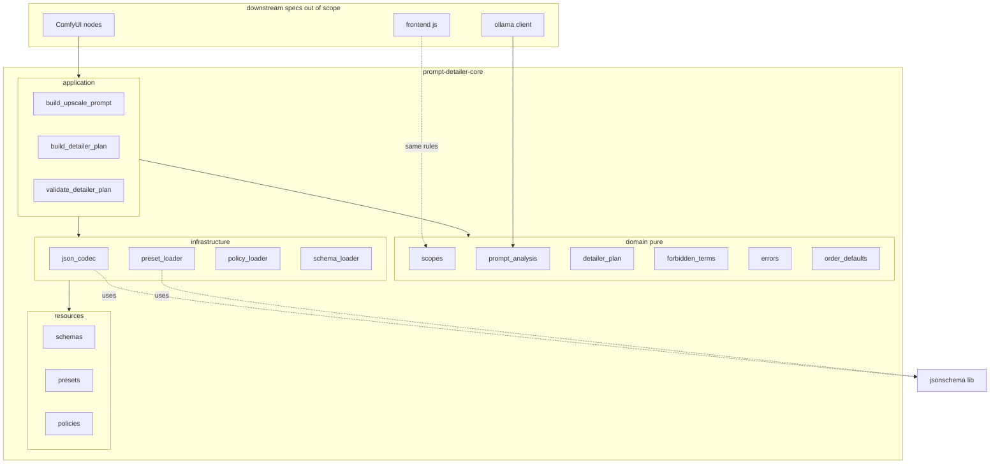
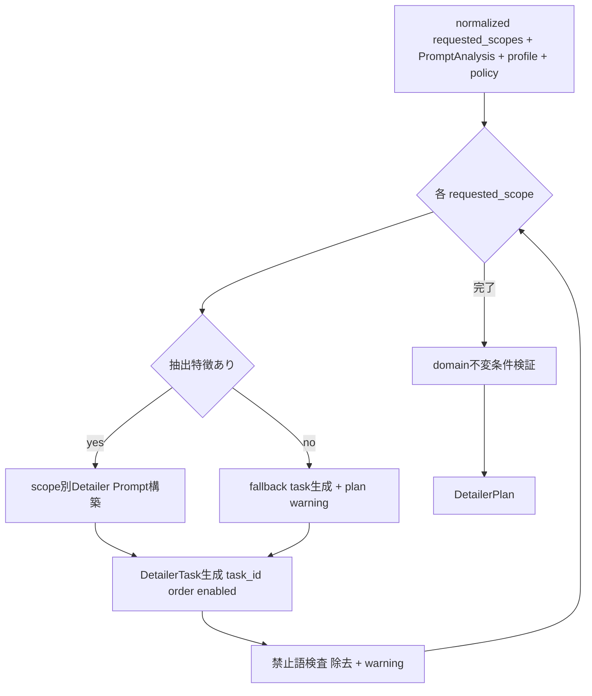
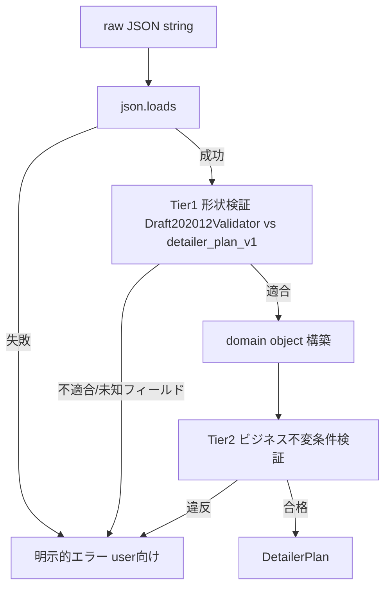
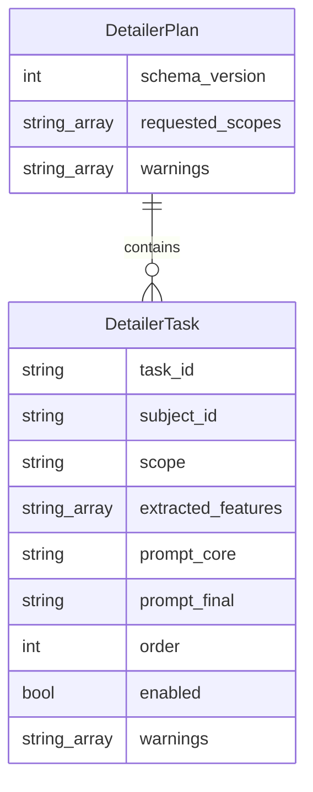

# Technical Design: prompt-detailer-core

## Overview

**Purpose**: 本 spec は `ComfyUI-Prompt-Detailer-Router` の中核ドメインを、Ollama / ComfyUI を起動せずに単体でテスト可能な純粋 Python レイヤーとして確立する。元プロンプトから抽出された「検証済み事実データ」を入力に、決定論的ロジックで `upscale_prompt` と `DETAILER_PLAN` を構築し、その契約（domain model・scope・schema・preset・prompt builder・validator・JSON codec）を安定化させる。

**Users**: 直接の利用者は下流 spec（`ollama-prompt-analyzer`、`detailer-plan-selection`、`dynamic-detailer-task-combo`）の実装者。これらは core の型と契約に依存して Analyzer / Selector / From JSON ノードとフロントエンドを構築する。エンドユーザー（ワークフロー利用者）へは下流 spec を通じて価値が届く。

**Impact**: 現在 documentation-first のリポジトリに、初めて実装コード（`prompt_detailer_router/` の domain / application / infrastructure と `resources/`、`tests/`）を導入する。以降の全 spec がこの契約を参照点とする。

### Goals
- `DetailerTask` / `DetailerPlan` を不変・情報無欠落の domain model として定義し、往復変換で情報を失わない。
- scope 正規化・`task_id` 生成・Plan 整合検証・preset 適用・禁止語検査・fallback を決定論的な純粋ロジックとして実装する。
- `DETAILER_PLAN` と Ollama response の JSON Schema を正本契約として確立し、contract test で保証する。
- 7 scope（`face`/`hair`/`hands`/`body`/`upper_body`/`clothing`/`generic`）の Detailer prompt と Upscale prompt を snapshot 可能な決定性で構築する。

### Non-Goals
- Ollama への実通信（`/api/chat`、timeout、retry、failure_mode、接続 diagnostics）→ `ollama-prompt-analyzer`。
- LLM 向け system prompt テキスト（extraction / repair）と client 実装 → `ollama-prompt-analyzer`。
- ComfyUI node class（Analyzer / Select / Inspector / From JSON の入出力）→ 各下流 spec。
- JavaScript 動的 combo とグラフ探索 → `dynamic-detailer-task-combo`。
- Selector の missing behavior、Override、packaging、Registry、example workflow、複数人物の完全対応、Detailer 自動実行。

## Boundary Commitments

### This Spec Owns
- **Domain model**: `DetailerTask`、`DetailerPlan`、`PromptAnalysis`（検証済み抽出結果）、scope 定義と正規化規則、`task_id` 生成規則、既定 order 表、error 階層。
- **ビジネス不変条件検証**: `task_id` 一意性、`scope ∈ requested_scopes`、`enabled ⇒ prompt_final 非空`、要求 scope ごとに 1 件以上の enabled task。
- **決定論的 prompt 構築**: Upscale Prompt Builder、scope 別 Detailer Prompt Builder、Plan Builder（欠落 scope の fallback task 生成を含む）、禁止語検査・除去。
- **JSON 契約**: `detailer_plan_v1.schema.json`、`ollama_response_v1.schema.json`、JSON codec（直列化 / 復号 + 形状検証）。
- **リソース**: upscale preset、detailer preset、detailer preset profile（`default_v1`）、`forbidden_terms_v1.json`、既定 order。
- **決定論バージョン定数**: `SCHEMA_VERSION`、`PROMPT_BUILDER_VERSION`。

### Out of Boundary
- Ollama client / 実通信 / retry / failure_mode / 接続 diagnostics。
- LLM system prompt テキストリソース（`prompts/extract_prompt_v1.txt` 等）。
- すべての ComfyUI node class と `compat.py` / `extension.py` の登録処理。
- フロントエンド JS（scope parser、graph resolver、combo 更新）。
- Selector の `missing_behavior`、`PDR_DetailerPlanFromJSON` ノード I/O（core は Plan Builder 契約のみ提供）。
- 複数人物（`subject_id` は既定 `main` 固定）、Plan Override / Merge / Executor。

### Allowed Dependencies
- Python 3.10+ 標準ライブラリ。
- `jsonschema>=4.20,<5`（**infrastructure 層のみ**、Schema 形状検証に限定）。domain / application は import しない。
- `resources/` 配下の version 付きリソースファイル（infrastructure の loader 経由でのみ読み込む）。
- 依存方向は一方向: `application → domain`、`application → infrastructure`、`infrastructure → resources`。逆方向・循環は禁止。domain は ComfyUI / Ollama / filesystem / jsonschema に依存しない。

### Revalidation Triggers
以下の変更は下流 spec / consumer に統合の再確認を強制する。
- `DETAILER_PLAN` / Ollama response の Schema 形状変更、`SCHEMA_VERSION` の変更。
- `DetailerTask` / `DetailerPlan` / `PromptAnalysis` のフィールド追加・削除・意味変更。
- scope 正規化規則・対応 scope 集合・`task_id` 規則の変更。
- preset / profile / 禁止語ポリシーの必須キー変更、既定 order 表の変更。
- `PROMPT_BUILDER_VERSION` / preset version / policy version の変更（キャッシュ無効化に影響）。
- Plan Builder の fallback / 欠落補完の挙動変更。

## Architecture

### Architecture Pattern & Boundary Map

steering 既定の一方向レイヤードアーキテクチャを採用する。core は「nodes 層を除いた」domain / application / infrastructure / resources を確立する。



**Architecture Integration**:
- **Selected pattern**: Layered（ports 相当は下流の nodes / ollama が担うが core 範囲外）。domain を純粋核として最内層に置く。
- **Domain/feature boundaries**: 検証を 2 段に分離。**形状検証**は infrastructure（`json_codec` が `jsonschema` で Schema ファイルに対し実施）、**ビジネス不変条件**は domain（`detailer_plan` の検証規則）。この分割で hidden shared ownership を排除する。
- **New components rationale**: 全コンポーネントが新規（greenfield）。各モジュールは reference §7 の推奨構成に一致させ、下流 spec が予測可能な import パスに依存できるようにする。
- **Steering compliance**: domain は ComfyUI/Ollama/FS/jsonschema 非依存（tech.md）。固定文・schema・preset・policy はリソース化（tech.md）。`eval`/`exec` 不使用（tech.md）。

### Technology Stack

| Layer | Choice / Version | Role in Feature | Notes |
|-------|------------------|-----------------|-------|
| Backend / Domain | Python 3.10+ | domain model、正規化、prompt 構築、不変条件検証 | 不変 `@dataclass(frozen=True, slots=True)`、型ヒント必須 |
| Data / Schema | JSON Schema Draft 2020-12 | `DETAILER_PLAN` / Ollama response の正本契約 | `resources/schemas/*.schema.json` |
| Validation lib | `jsonschema>=4.20,<5` | Schema 形状検証（infra 限定、runtime 依存） | `Draft202012Validator`。domain は不使用 |
| Resource I/O | 標準 `json` / `pathlib` / `importlib.resources` | preset・policy・schema 読込 | infrastructure に隔離 |
| Test | `pytest` | unit / contract / snapshot | 実 Ollama 不要。fixture ベース |

依存追加の根拠（CLAUDE.md §12）: Draft 2020-12 の `additionalProperties:false` / `$ref` を含む堅牢検証は標準ライブラリでの自作が誤りやすく、Schema ファイルとのドリフトも招くため `jsonschema` を採用。利用を infrastructure に限定し domain 純粋性を保つ。詳細は `research.md`。

## File Structure Plan

### Directory Structure
```
prompt_detailer_router/
├── __init__.py                         # パッケージ初期化のみ（ロジック禁止）
├── domain/
│   ├── __init__.py
│   ├── scopes.py                       # 対応scope集合・正規化・未対応scope破棄+warning
│   ├── order_defaults.py               # scope別既定order表（reference §14.4）
│   ├── prompt_analysis.py              # PromptAnalysis（検証済み抽出結果）domain model
│   ├── detailer_plan.py                # DetailerTask/DetailerPlan + ビジネス不変条件検証
│   ├── forbidden_terms.py              # 禁止語除去の純粋関数（policyデータを受け取る）
│   ├── prompt_text.py                  # prompt結合・重複除去・空白正規化の純粋ヘルパ
│   └── errors.py                       # error階層（user向け/内部）
├── application/
│   ├── __init__.py
│   ├── build_upscale_prompt.py         # Upscale Prompt Builder use case
│   ├── build_detailer_plan.py          # Plan Builder（抽出→Plan、fallback、order、preset、禁止語）
│   └── validate_detailer_plan.py       # Plan整合検証 use case（domain規則へ委譲）
├── infrastructure/
│   ├── __init__.py
│   ├── schema_loader.py                # JSON Schemaファイル読込 + Draft202012Validator生成（キャッシュ）
│   ├── json_codec.py                   # DETAILER_PLAN 直列化/復号 + 形状検証（Tier1）
│   ├── preset_loader.py                # upscale/detailer preset + profile 読込・必須キー検証
│   └── policy_loader.py                # forbidden_terms policy 読込
├── resources/
│   ├── schemas/
│   │   ├── detailer_plan_v1.schema.json
│   │   └── ollama_response_v1.schema.json
│   ├── presets/
│   │   ├── upscale/{photographic,illustration,minimal}.json
│   │   ├── detailer/{face,hair,hands,body,upper_body,clothing,generic}.json
│   │   └── detailer_profiles/default_v1.json
│   └── policies/
│       └── forbidden_terms_v1.json
└── utils/
    ├── __init__.py
    └── collections.py                  # 順序保持dedupなど純粋ユーティリティ

tests/
├── conftest.py
├── unit/                               # scope/task_id/plan/builder/codec/preset/forbidden
├── contract/                           # schema適合・拒否・schema_version互換・preset必須キー
├── fixtures/                           # PromptAnalysis相当のOllama応答JSON、完成Plan JSON
└── snapshots/                          # upscale + 7 scope detailer 完成プロンプト
```

> `nodes/`、`compat.py`、`extension.py`、`infrastructure/ollama_client.py`、`resources/prompts/`、`web/js/` は本 spec では**作成しない**（下流 spec 所有）。

### Modified Files
- なし（新規実装。既存の docs / steering は変更しない）。
- `pyproject.toml` は本リポジトリに未作成。runtime 依存 `jsonschema` と `pytest` を伴う最小限のパッケージ定義は `packaging-and-release` spec が所有するため、core では **依存要件を design に明記するに留め**、正式な `pyproject.toml` 作成は当該 spec に委ねる（テスト実行に最小限必要な場合は同 spec と整合する形で追補する）。

_Boundary 注記_: 各ファイルは単一責務。domain 配下は `jsonschema` / `pathlib` / ComfyUI / Ollama を import しない。`jsonschema` の import は `infrastructure/{schema_loader,json_codec,preset_loader}.py` に限る。

## System Flows

### Plan 構築フロー（Plan Builder）

- 各 scope につき、抽出特徴があれば preset と結合して `prompt_final` を構築、なければ preset のみの非空 fallback task（`extracted_features=[]`）を生成し plan-level warning に記録（Req 6.1–6.3）。
- `prompt_final` / `upscale_prompt` は結合確定後に禁止語検査（Req 9.2）。除去後に空白正規化。
- 最終的に domain 不変条件を検証（Req 5）。違反は `PlanValidationError`。

### JSON 復号フロー（2 段検証）

- Tier1（infra）は形状（必須項目・型・`additionalProperties:false`）を Schema ファイルで検証（Req 11.3, 12.4）。Tier2（domain）はビジネス不変条件（Req 5）。黙った補正・破棄は行わない（Req 12.5, 14.5）。

## Requirements Traceability

| Requirement | Summary | Components | Interfaces | Flows |
|-------------|---------|------------|------------|-------|
| 1.1–1.5 | scope 正規化（分割/trim/小文字/空除去/順序保持dedup/決定性） | `domain/scopes.py` | `normalize_scopes` | — |
| 2.1–2.3 | 未対応scope warning付き破棄・継続 | `domain/scopes.py` | `normalize_scopes` | — |
| 3.1–3.4 | task_id 生成・既定subject・重複抑止・一意 | `domain/detailer_plan.py`, `build_detailer_plan` | `make_task_id`, Plan Builder | Plan構築 |
| 4.1–4.5 | 不変 domain model・必須フィールド・requested_scopes正規化・schema_version | `domain/detailer_plan.py` | `DetailerTask`, `DetailerPlan` | — |
| 5.1–5.5 | Plan整合契約（scope包含/enabled非空/disabled空許容/1 enabled per scope） | `domain/detailer_plan.py`, `validate_detailer_plan` | `DetailerPlan.validate` | JSON復号, Plan構築 |
| 6.1–6.5 | Plan Builder・欠落fallback・抽出値非採用・無断追加禁止 | `application/build_detailer_plan.py` | `build_detailer_plan` | Plan構築 |
| 7.1–7.3 | Upscale prompt構築・無断追加禁止・決定性 | `application/build_upscale_prompt.py` | `build_upscale_prompt` | — |
| 8.1–8.5 | scope別Detailer prompt・混入禁止・再設計禁止・7scope・決定性 | `application/build_detailer_plan.py`, `domain/prompt_text.py` | scope builder | Plan構築 |
| 9.1–9.5 | 禁止語ポリシー・結合後検査・除去+warning・両builder共有・LLM非委任 | `domain/forbidden_terms.py`, `infrastructure/policy_loader.py` | `apply_forbidden_terms`, `load_policy` | Plan構築 |
| 10.1–10.7 | preset/profile必須キー・設定エラー・既定profile・既定order | `infrastructure/preset_loader.py`, `domain/order_defaults.py` | `load_upscale_preset`, `load_detailer_profile`, `DEFAULT_ORDER` | — |
| 11.1–11.4 | DETAILER_PLAN Schema・未知拒否・形状検証・contract | `resources/schemas/detailer_plan_v1.schema.json`, `json_codec`, `schema_loader` | Schema, `decode_plan` | JSON復号 |
| 12.1–12.5 | JSON codec往復・情報無欠落・未知拒否・不正明示エラー | `infrastructure/json_codec.py` | `encode_plan`, `decode_plan` | JSON復号 |
| 13.1–13.3 | Ollama response Schema土台・contract・通信除外 | `resources/schemas/ollama_response_v1.schema.json`, `domain/prompt_analysis.py` | Schema, `PromptAnalysis` | — |
| 14.1–14.6 | 純粋テスト可能・リソース化・error区別・no eval・no黙殺・snapshot | 全モジュール, `domain/errors.py` | error階層 | 2段検証 |

## Components and Interfaces

| Component | Domain/Layer | Intent | Req Coverage | Key Dependencies (P0/P1) | Contracts |
|-----------|--------------|--------|--------------|--------------------------|-----------|
| scopes | domain | scope 正規化と対応検証 | 1, 2 | — | Service |
| detailer_plan | domain | Plan/Task model と不変条件 | 3, 4, 5 | scopes (P0), order_defaults (P1) | Service, State |
| prompt_analysis | domain | 検証済み抽出結果 model | 6, 13 | scopes (P1) | State |
| forbidden_terms | domain | 禁止語除去（純粋） | 9 | — | Service |
| prompt_text | domain | 結合/dedup/空白正規化 | 7, 8 | — | Service |
| build_detailer_plan | application | Plan Builder | 3, 5, 6, 8, 9, 10 | detailer_plan (P0), preset_loader (P0), policy_loader (P0) | Service |
| build_upscale_prompt | application | Upscale Builder | 7, 9 | prompt_text (P0), preset_loader (P0), policy_loader (P0) | Service |
| validate_detailer_plan | application | Plan整合検証 use case | 5 | detailer_plan (P0) | Service |
| json_codec | infrastructure | 直列化/復号 + 形状検証 | 11, 12 | schema_loader (P0), detailer_plan (P0) | Service |
| preset_loader | infrastructure | preset/profile 読込・検証 | 10 | jsonschema/json (P1) | Service |
| policy_loader | infrastructure | 禁止語 policy 読込 | 9 | json (P1) | Service |
| schema_loader | infrastructure | Schema 読込 + validator 生成 | 11, 13 | jsonschema (P0) | Service |

### domain

#### scopes

| Field | Detail |
|-------|--------|
| Intent | scope 文字列の正規化と対応 scope 検証、未対応 scope の破棄と warning 生成 |
| Requirements | 1.1, 1.2, 1.3, 1.4, 1.5, 2.1, 2.2, 2.3 |

**Responsibilities & Constraints**
- 対応 scope 集合 `SUPPORTED_SCOPES = (face, hair, hands, body, upper_body, clothing, generic)` を正本として保持。
- 正規化は「分割 → trim → 小文字 → 空除去 → 順序保持 dedup → 対応照合」。未対応は破棄し warning に記録。処理は失敗させない。
- 純粋・決定論的。外部 I/O なし。

**Dependencies**: Inbound: `detailer_plan`, `build_detailer_plan`（P0）。Outbound/External: なし。

**Contracts**: Service [x] / State [ ]

##### Service Interface
```python
SUPPORTED_SCOPES: tuple[str, ...]

@dataclass(frozen=True, slots=True)
class ScopeNormalizationResult:
    requested_scopes: tuple[str, ...]   # 正規化済み・対応済み・重複なし・入力初出順
    dropped_scopes: tuple[str, ...]     # 未対応で破棄した scope（正規化後表記）
    warnings: tuple[str, ...]           # 破棄・空入力に関する warning 文

def normalize_scopes(raw: str) -> ScopeNormalizationResult: ...
def is_supported_scope(scope: str) -> bool: ...
```
- Preconditions: `raw` は任意文字列（None 不可）。
- Postconditions: `requested_scopes` は `SUPPORTED_SCOPES` の部分集合かつ重複なし。`dropped_scopes` が非空なら対応する `warnings` を含む。空入力時は `requested_scopes=()` かつ warning。
- Invariants: 同一入力 → 同一出力。

#### detailer_plan

| Field | Detail |
|-------|--------|
| Intent | `DetailerTask` / `DetailerPlan` の不変 model と `task_id` 生成、ビジネス不変条件検証（Tier2） |
| Requirements | 3.1, 3.2, 3.3, 3.4, 4.1, 4.2, 4.3, 4.4, 4.5, 5.1, 5.2, 5.3, 5.4, 5.5 |

**Responsibilities & Constraints**
- `@dataclass(frozen=True, slots=True)` で不変表現。`tuple` を配列に使い共有変更を防ぐ。
- `task_id = f"{subject_id}.{scope}"`。既定 `subject_id="main"`。同一 `subject_id+scope` は 1 件に制限。
- 検証規則（純粋）: `task_id` 一意 / `scope ∈ requested_scopes` / `enabled=true ⇒ prompt_final 非空` / `enabled=false ⇒ prompt_final 空許容` / 要求 scope ごとに 1 件以上の `enabled=true`。
- domain のため `jsonschema` / FS を import しない。

**Dependencies**: Inbound: `json_codec`, `build_detailer_plan`, `validate_detailer_plan`（P0）。Outbound: `scopes`（P0）、`order_defaults`（P1）。

**Contracts**: Service [x] / State [x]

##### Service Interface
```python
SCHEMA_VERSION: int = 1

@dataclass(frozen=True, slots=True)
class DetailerTask:
    task_id: str
    subject_id: str
    scope: str
    extracted_features: tuple[str, ...]
    prompt_core: str
    prompt_final: str
    order: int
    enabled: bool
    warnings: tuple[str, ...]

@dataclass(frozen=True, slots=True)
class DetailerPlan:
    schema_version: int
    requested_scopes: tuple[str, ...]
    tasks: tuple[DetailerTask, ...]
    warnings: tuple[str, ...]

def make_task_id(subject_id: str, scope: str) -> str: ...

@dataclass(frozen=True, slots=True)
class PlanValidationIssue:
    code: str          # 例: "scope_not_requested", "empty_prompt_final", "missing_enabled_task"
    message: str
    task_id: str | None

def validate_plan(plan: DetailerPlan) -> tuple[PlanValidationIssue, ...]: ...
```
- Preconditions: `validate_plan` は構築済み `DetailerPlan` を受け取る。
- Postconditions: 空 tuple なら整合。非空なら各違反を `PlanValidationIssue` で列挙（黙殺しない）。
- Invariants: model は生成後不変。`requested_scopes` は正規化済み重複なし。

**Implementation Notes**
- Integration: `json_codec` と `build_detailer_plan` の双方が `validate_plan` を最終ゲートに使う。
- Validation: 違反時に use case 層が `PlanValidationError`（`errors.py`）へ昇格。
- Risks: 検証規則と Schema のドリフト → contract test で双方に同一 fixture を通す。

#### prompt_analysis

| Field | Detail |
|-------|--------|
| Intent | Ollama 抽出結果を表す検証済み domain model。供給元（Ollama/fixture/From JSON）非依存 | 
| Requirements | 6.1, 13.1, 13.3 |

**Responsibilities & Constraints**
- `global_features`（medium/style/lighting/camera/material/texture/environment/subject などのカテゴリ別特徴）と `scoped_features: dict[str, tuple[str,...]]`、`warnings` を保持。
- `ollama_response_v1.schema.json` に対応する構造。ただし本 model 自体は純粋 domain 型で、Schema 検証は infra（`schema_loader`/analyzer）が担う。
- core は本 model への「変換済みデータ」を前提とし、実通信は所有しない（Req 13.3）。

**Contracts**: State [x]

##### State Management
```python
@dataclass(frozen=True, slots=True)
class PromptAnalysis:
    global_features: Mapping[str, tuple[str, ...]]
    scoped_features: Mapping[str, tuple[str, ...]]   # key は正規化 scope
    warnings: tuple[str, ...]

def features_for_scope(analysis: PromptAnalysis, scope: str) -> tuple[str, ...]: ...
```
- Invariants: 不変。`scoped_features` の key は対応 scope のみ（未対応は Plan Builder 到達前に破棄済み前提）。

#### forbidden_terms / prompt_text

| Field | Detail |
|-------|--------|
| Intent | 禁止語の除去（純粋）と、prompt 結合・重複除去・空白正規化の純粋ヘルパ |
| Requirements | 7.1, 8.1, 8.2, 8.3, 9.2, 9.3 |

**Contracts**: Service [x]

##### Service Interface
```python
@dataclass(frozen=True, slots=True)
class ForbiddenScanResult:
    text: str            # 除去後（空白正規化済み）
    removed_count: int
    removed_terms: tuple[str, ...]

def apply_forbidden_terms(text: str, terms: tuple[str, ...], match: str) -> ForbiddenScanResult: ...

def join_prompt(parts: Sequence[str]) -> str: ...          # 空要素除去 + 区切り整形
def dedup_features(features: Sequence[str]) -> tuple[str, ...]: ...  # 順序保持
def normalize_whitespace(text: str) -> str: ...
```
- Postconditions: `apply_forbidden_terms` は `match="case_insensitive_literal"` で語を除去し、除去後に空白を正規化。`removed_count>0` なら呼び出し側が warning を生成。
- Invariants: 純粋・決定論的。

### application

#### build_detailer_plan（Plan Builder）

| Field | Detail |
|-------|--------|
| Intent | 正規化 scope + `PromptAnalysis` + profile + policy から `DETAILER_PLAN` を決定論的に構築 |
| Requirements | 3.1, 3.3, 5.3, 6.1, 6.2, 6.3, 6.4, 6.5, 8.1, 8.4, 9.4, 10.6, 10.7 |

**Responsibilities & Constraints**
- 各 `requested_scope` について task を生成。抽出特徴があれば scope 別 preset（preservation/local_details/restrictions）と結合、なければ preset のみの非空 fallback task（`extracted_features=()`、`enabled=true`）を生成し plan warning に記録。
- 抽出結果の `task_id`/`prompt_final`/維持文/局所文は採用しない。元プロンプトにない具体属性を追加しない。
- `order` は preset の `default_order`、無ければ既定 order 表。`prompt_final` 確定後に禁止語検査を適用。最後に `validate_plan` を実行。

**Dependencies**: Inbound: 下流 Analyzer / From JSON（範囲外）。Outbound: `detailer_plan`（P0）、`prompt_text`/`forbidden_terms`（P0）、`preset_loader`/`policy_loader`（P0）、`order_defaults`（P1）。

**Contracts**: Service [x]

##### Service Interface
```python
@dataclass(frozen=True, slots=True)
class PlanBuildInput:
    requested_scopes: tuple[str, ...]
    analysis: PromptAnalysis
    profile_id: str = "default_v1"
    subject_id: str = "main"

def build_detailer_plan(build_input: PlanBuildInput) -> DetailerPlan: ...
```
- Preconditions: `requested_scopes` は正規化済み・対応済み。
- Postconditions: 各 requested scope に少なくとも 1 件の `enabled=true` task。返り値は `validate_plan` に合格。禁止語除去数は task/plan warning に反映。
- Invariants: 同一入力・同一 preset/policy/builder version → 同一 Plan。

**Implementation Notes**
- Integration: `PromptAnalysis` を fixture から与えれば Ollama なしで完全テスト可能。
- Validation: profile / preset 欠落は `preset_loader` が `ConfigurationError` を送出（Req 10.4/10.5）。
- Risks: fallback 文が preset 依存 → snapshot test で 7 scope を固定。

#### build_upscale_prompt（Upscale Builder）

| Field | Detail |
|-------|--------|
| Intent | `PromptAnalysis` の global 情報 + upscale preset から `upscale_prompt` を構築 |
| Requirements | 7.1, 7.2, 7.3, 9.4 |

**Contracts**: Service [x]

##### Service Interface
```python
def build_upscale_prompt(analysis: PromptAnalysis, upscale_preset_id: str) -> UpscaleBuildResult: ...

@dataclass(frozen=True, slots=True)
class UpscaleBuildResult:
    upscale_prompt: str
    warnings: tuple[str, ...]   # 禁止語除去などの通知
```
- Postconditions: 抽出済み画風/照明/材質/カメラ/背景 + preset の quality_details/preservation/restrictions を結合。元プロンプトにない被写体特徴は追加しない。禁止語検査を適用。同一入力・preset version で同一出力。

#### validate_detailer_plan
- `validate_plan`（domain）を呼び、違反を `PlanValidationError`（user 向け）へ昇格する薄い use case（Req 5）。二重ロジックを持たない。

### infrastructure

#### json_codec

| Field | Detail |
|-------|--------|
| Intent | `DetailerPlan` の JSON 直列化 / 復号と Tier1 形状検証 |
| Requirements | 11.3, 12.1, 12.2, 12.3, 12.4, 12.5 |

**Dependencies**: Outbound: `schema_loader`（P0）、`detailer_plan`（P0）。External: `jsonschema`（P0）。

**Contracts**: Service [x]

##### Service Interface
```python
def encode_plan(plan: DetailerPlan) -> str: ...              # 全フィールド保持

def decode_plan(raw_json: str) -> DetailerPlan: ...          # parse → Tier1形状検証 → 構築 → Tier2不変条件
```
- Preconditions: `decode_plan` の入力は文字列。
- Postconditions: `encode_plan`→`decode_plan` は情報無欠落（往復同値）。未知フィールド・型不一致・不正 JSON は `PlanDecodeError`（明示的、黙殺/補正なし）。Tier2 違反は `PlanValidationError`。
- Invariants: 直列化は決定論的（キー順序安定、`ensure_ascii=False`）。

**Implementation Notes**
- Integration: Analyzer の `detailer_json` 出力と From JSON の `finalized_plan_json` 経路が本 codec を再利用（下流）。
- Validation: `Draft202012Validator` を `schema_loader` から取得しキャッシュ。
- Risks: エンコード時のキー順序揺れ → 明示的な順序付けで snapshot 安定化。

#### preset_loader / policy_loader / schema_loader

| Field | Detail |
|-------|--------|
| Intent | version 付きリソース（preset/profile/policy/schema）の読込と必須キー・整合検証 |
| Requirements | 9.1, 10.1, 10.2, 10.3, 10.4, 10.5, 11.1, 13.1, 13.2 |

**Contracts**: Service [x]

##### Service Interface
```python
@dataclass(frozen=True, slots=True)
class UpscalePreset:
    version: str; preset_id: str
    quality_details: str; preservation: str; restrictions: str

@dataclass(frozen=True, slots=True)
class DetailerPreset:
    version: str; scope: str
    preservation: str; local_details: str; restrictions: str
    default_order: int | None = None

@dataclass(frozen=True, slots=True)
class DetailerProfile:
    version: str; profile_id: str
    mappings: Mapping[str, str]   # scope -> detailer preset id（7 scope 必須）

def load_upscale_preset(preset_id: str) -> UpscalePreset: ...
def load_detailer_profile(profile_id: str) -> DetailerProfile: ...
def load_detailer_preset(preset_id: str) -> DetailerPreset: ...
def load_forbidden_terms_policy(policy_id: str = "forbidden_terms_v1") -> ForbiddenTermsPolicy: ...
def get_plan_validator() -> Draft202012Validator: ...   # schema_loader
```
- Postconditions: 必須キー欠落・profile mapping 欠落・mapping 先 preset の `scope` 不一致は `ConfigurationError`（暗黙 fallback しない）。未指定時は既定（`default_v1` / `forbidden_terms_v1`）。
- Invariants: 読込結果は不変 dataclass。同一リソースファイル → 同一結果。

**Implementation Notes**
- Integration: `importlib.resources` でパッケージ同梱リソースを解決（ComfyUI 実行位置に非依存）。
- Validation: preset/profile/policy 自体も contract test で必須キーを検証。
- Risks: リソース同梱漏れ → contract test で全 preset/profile/policy の読込を検証。

## Data Models

### Domain Model
- **集約ルート**: `DetailerPlan`（`DetailerTask` を保持）。トランザクション境界は Plan 単位。
- **値オブジェクト**: `DetailerTask`、`PromptAnalysis`、preset/profile/policy 各 dataclass、`ScopeNormalizationResult`。すべて不変。
- **不変条件（invariants）**: Req 5 の 5 規則。加えて `requested_scopes` は正規化済み重複なし、`task_id` は Plan 内一意。



### Data Contracts & Integration

**DETAILER_PLAN JSON Schema（`detailer_plan_v1.schema.json`, Draft 2020-12）**
- root required: `schema_version`, `requested_scopes`, `tasks`, `warnings`。`additionalProperties: false`。
- `schema_version`: `const: 1`（互換性の明示ゲート）。
- `requested_scopes`: `array<string>`、`uniqueItems: true`、`enum` は 7 scope。
- `tasks[]` required: 全 9 フィールド。`additionalProperties: false`。`scope` は 7 scope の enum。`order` は integer、`enabled` は boolean。
- 将来拡張は `schema_version` 更新 or 明示 `metadata` 追加として扱う（黙った未知フィールドは拒否）。

**Ollama response Schema（`ollama_response_v1.schema.json`, Draft 2020-12）— 土台のみ**
- required: `global`, `scoped_features`。`warnings` は任意。
- `global`: object（style/lighting/camera/material/texture/environment/subject などのカテゴリ、各 `array<string>`）。
- `scoped_features`: object（key=scope、value=`array<string>`）。
- core は Schema と `PromptAnalysis` への対応のみ所有。実際の LLM 呼び出し・prompt・retry は analyzer spec（Req 13.3）。

**シリアライズ形式**: JSON、UTF-8、`ensure_ascii=False`、キー順序安定。`encode_plan`/`decode_plan` の往復で同値（Req 12.3）。

## Error Handling

### Error Strategy
`domain/errors.py` に階層を定義し、**user 向け**と**内部**を区別（Req 14.3）。use case 層で domain の検証結果を user 向け例外へ昇格。黙った破棄・補正は禁止（Req 14.5）。

```python
class PDRError(Exception): ...                 # 基底
class PDRUserError(PDRError): ...              # ユーザーに提示・回復可能
class ConfigurationError(PDRUserError): ...    # preset/profile/policy 設定不備 (10.4, 10.5)
class PlanDecodeError(PDRUserError): ...       # 不正JSON/形状不一致/未知フィールド (12.4, 12.5)
class PlanValidationError(PDRUserError): ...   # ビジネス不変条件違反 (5.x)
class PDRInternalError(PDRError): ...          # 想定外の内部不整合
```

### Error Categories and Responses
- **入力/設定エラー（user）**: 未対応 scope は error ではなく warning + 破棄（Req 2）。preset 欠落・profile mapping 欠落は `ConfigurationError`（明示、暗黙 fallback 禁止）。
- **JSON/契約エラー（user）**: parse 失敗・Schema 非適合・未知フィールドは `PlanDecodeError`。メッセージに違反箇所を含める。
- **ビジネス規則エラー（user）**: `PlanValidationError` に `PlanValidationIssue` 一覧を添付。
- **内部エラー**: `PDRInternalError`。握りつぶさない（steering: 広い `except` 禁止）。

### Monitoring
- core はロギング基盤を持たないが、warning（scope 破棄数、禁止語除去数、fallback task 数）を model/戻り値に構造化して返し、下流の diagnostics 集約（analyzer spec）が消費できるようにする。秘密情報・ローカルパスは warning に含めない（steering）。

## Testing Strategy

### Unit Tests
- `normalize_scopes`: `"Face, hair, face,  hands"` → `("face","hair","hands")`；未対応 scope 破棄 + warning；空入力 → `()` + warning（1.x, 2.x）。
- `make_task_id` / 重複抑止: `main.face` 生成、同一 `subject+scope` 二重生成の 1 件化（3.x）。
- `validate_plan`: `scope ∉ requested_scopes` / `enabled=true` かつ空 `prompt_final` / 要求 scope に enabled task 無し を各々検出；`enabled=false` の空 `prompt_final` は合格（5.x）。
- `apply_forbidden_terms`: `beautiful/perfect/symmetrical` を大小無視で除去 + 空白正規化 + `removed_count`（9.2, 9.3）。
- `build_detailer_plan` fallback: 抽出特徴欠落 scope に非空 fallback task + plan warning、`extracted_features=()`（6.2, 6.3）。

### Contract Tests
- `detailer_plan_v1.schema.json`: 正例が適合、未知フィールド/欠落必須/`schema_version≠1` が拒否（11.1, 11.2, 11.4）。
- 二重検証整合: 代表 Plan JSON を Schema（infra）と `validate_plan`（domain）双方に通し判定が矛盾しない。
- `ollama_response_v1.schema.json`: `global`/`scoped_features` 必須、追加検証（13.1, 13.2）。
- preset/profile/policy: 全 upscale/detailer preset・`default_v1`・`forbidden_terms_v1` が必須キーを満たし読込可能；必須キー欠落・mapping 欠落・scope 不一致で `ConfigurationError`（10.x, 9.1）。

### Integration Tests
- fixture `PromptAnalysis`（写真/イラスト/顔アップ/全身/人物なし/短文/矛盾特徴）→ `build_detailer_plan` → `encode_plan` → `decode_plan` の往復同値（6.x, 12.3）。
- `build_upscale_prompt`: fixture → 元プロンプトにない被写体特徴が混入しないことを検証（7.2）。

### Snapshot Tests
- 代表元プロンプト集合ごとに、`upscale_prompt` と 7 scope の `prompt_final`、および warnings を snapshot 化（8.4, 14.6）。preset 変更が該当 scope の snapshot のみに反映されることを確認（reference §22 preset 受入条件）。

## Security Considerations
- model 出力・利用者入力に対し `eval`/`exec` 不使用（Req 14.4、steering）。
- `jsonschema` は infra 限定。復号は Schema 検証を通過したデータのみ domain へ渡す（信頼境界）。
- warning/error メッセージにローカルパス・秘密情報を含めない。
- 未知フィールドの黙殺・不正データの黙った破棄を禁止（Req 12.4, 12.5, 14.5）。

## Performance & Scalability
- 全処理は入力 scope 数・特徴数に対し O(n)。1 ワークフロー実行あたりのタスク数は小さく、性能上の懸念は限定的。
- `schema_loader` は validator をプロセス内キャッシュし、Schema 再コンパイルを避ける。
- 決定性: `PROMPT_BUILDER_VERSION` / preset version / policy version を出力の再現性根拠とし、下流のキャッシュキー（analyzer spec 所有）へ供給する。
