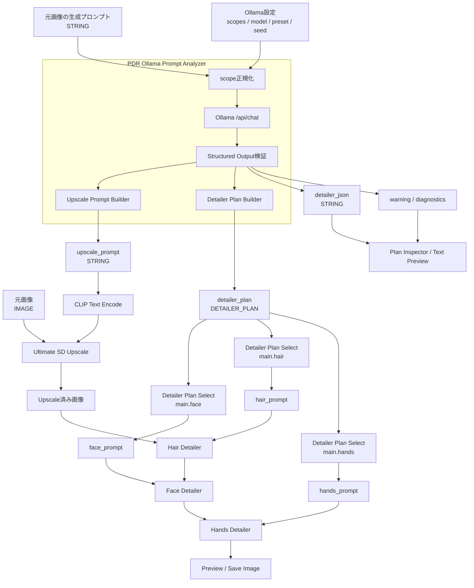
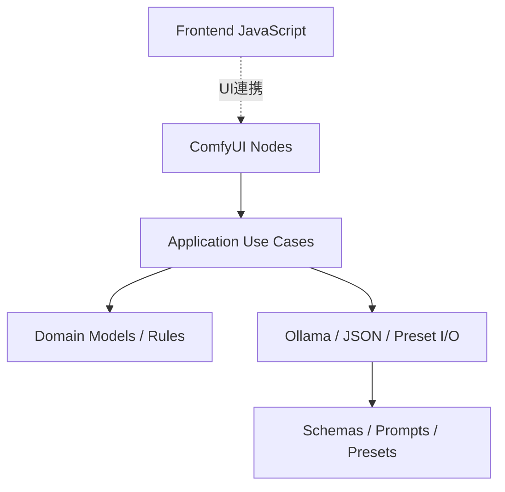
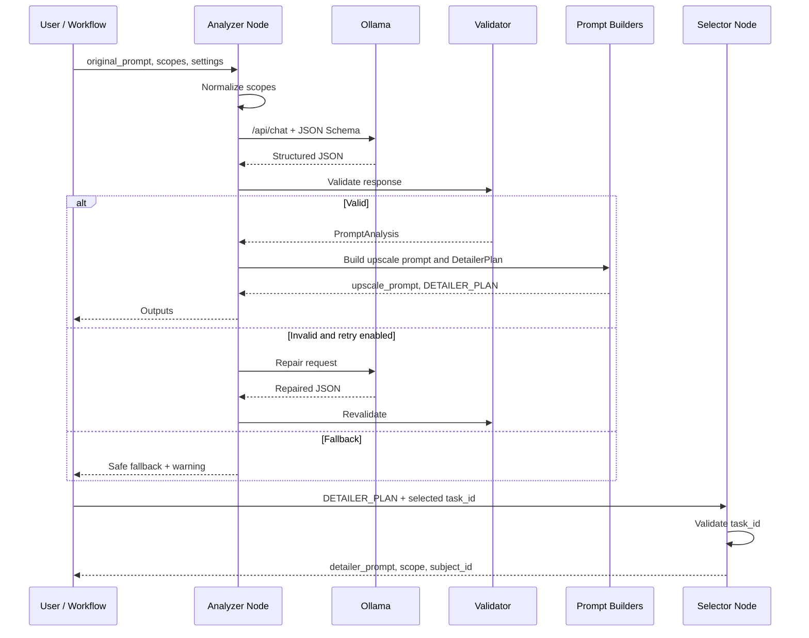

# ComfyUI-Prompt-Detailer-Router 要件・設計リファレンス

## 1. 文書の位置付け

本書は、`ComfyUI-Prompt-Detailer-Router`をcc-sddによる仕様駆動開発で設計・実装する際の参考資料です。

本書の目的:

- 要件定義時の論点を整理する
- 設計案のたたき台を提供する
- cc-sddの`requirements.md`、`design.md`、`tasks.md`作成を支援する
- Codexにプロジェクトの背景と設計意図を伝える
- 将来の拡張で初期設計が崩れることを防ぐ

本書は参考書であり、cc-sddで承認された仕様が最終的な正本です。

---

# 2. プロジェクト概要

## 2.1 背景

現在の画像生成ワークフローでは、元画像の生成プロンプトから次の情報を手作業で転記する必要があります。

- Ultimate SD Upscaleに使用する品質・材質・照明・カメラ・背景情報
- Detailer（SEGS）に使用する顔、髪、手、衣服などの対象部位情報
- 短い構図・同一性維持指示
- 部位固有の局所ディテール指示

手動転記には次の課題があります。

- 作業量が多い
- 元プロンプトとの不整合が起きる
- 部位ごとのプロンプト管理が複雑になる
- 複数人物や複数部位への拡張が難しい
- LLM出力が毎回変化し、再現性が下がる
- ワークフロー内に長い固定文が散在する

本プロジェクトでは、Ollama上のローカルLLMで元プロンプトを構造化解析し、Python側の決定論的ロジックで最終プロンプトを構築します。

## 2.2 想定環境

- ComfyUI
- Ultimate SD Upscale
- Impact Pack Detailer（SEGS）
- Ollama
- ローカルLLM
- Pythonバックエンドカスタムノード
- ComfyUI JavaScriptフロントエンド拡張
- cc-sdd
- Codex
- GitHub

---

# 3. 目標

## 3.1 機能目標

1. 元画像の生成プロンプトを入力できる
2. 複数scopeをカンマ区切りSTRINGで指定できる
3. Ollamaで元プロンプトを構造化解析できる
4. Ultimate SD Upscale向けの`upscale_prompt`を生成できる
5. 複数のDetailer処理を`DETAILER_PLAN`へ格納できる
6. `DETAILER_PLAN`から任意のタスクを選択できる
7. 選択したタスクの`detailer_prompt`を取得できる
8. Analyzerの`scopes`からSelectorのコンボ候補を動的に生成できる
9. JSONとInspectorで解析結果を確認できる
10. 不正JSONやOllama障害時に明確なエラーまたは安全なフォールバックを提供できる

## 3.2 品質目標

- 元プロンプトにない特徴を勝手に追加しにくい
- 同一入力・同一seedで結果を再現しやすい
- ComfyUIを起動せず主要ロジックをテストできる
- PythonとJavaScriptの責務が明確
- 複数人物や新scopeへ拡張できる
- プリセット変更にコード修正を必要としない
- ワークフロー保存後も接続と選択値が安定する

---

# 4. 初期スコープ

## 4.1 初期対応

- 単一人物を主対象とする
- scope:
  - `face`
  - `hair`
  - `hands`
  - `body`
  - `upper_body`
  - `clothing`
  - `generic`
- Ollama `/api/chat`
- Structured OutputまたはJSON Schema
- AnalyzerからSelectorへの直接接続
- Reroute経由
- 同一グラフ内
- JSON出力
- Inspector
- JSONからPlanへの変換
- pytest
- JavaScript単体テスト
- ComfyUI V3 Schemaを基本方針とする

## 4.2 初期対象外

- SetNode/GetNode経由の接続元探索
- サブグラフをまたぐ探索
- Detailerの自動実行
- SEGSと人物の完全自動対応
- LLM結果による動的outputソケット
- クラウドLLM
- Ollama以外のバックエンド
- GUI上でのプリセット編集
- 顔認識による人物同定
- 自動マスク生成の統合

---

# 5. 主要ユースケース

## UC-01: Upscale用プロンプト生成

入力:

- 元プロンプト
- `scopes`
- Ollama設定
- Upscale preset

出力:

- `upscale_prompt`

期待:

- 元の画風、照明、材質、カメラ、背景情報を抽出する
- 具体的な品質向上指示を追加する
- 短い維持指示を追加する
- 元プロンプトにない被写体特徴を追加しない

## UC-02: 複数Detailerタスク生成

入力:

```text
scopes = face,hair,hands
```

出力:

```text
main.face
main.hair
main.hands
```

各タスクにはscope固有の`prompt_final`を含めます。

## UC-03: Detailerタスク選択

Selectorで`main.hair`を選択すると、hair用の`detailer_prompt`を出力します。

## UC-04: 動的コンボ更新

Analyzerの`scopes`を、

```text
face,hair
```

から、

```text
face,hands
```

へ変更した場合、Selector候補も更新します。

現在`main.hair`が選択されている場合は、安全な候補へ切り替えます。

## UC-05: 不正JSON

OllamaがSchema違反のレスポンスを返した場合:

- strict: エラー
- retry_once: 修復指示で1回だけ再試行
- safe_fallback: 固定プロンプトへ切り替え

## UC-06: LLM Text Processor互換

既存のLLM Text Processorで生成したJSONを、`Detailer Plan From JSON`で`DETAILER_PLAN`へ変換できます。

---

# 6. 推奨ワークフロー構成



## 6.1 処理順の考え方

例として次の順序を想定します。

```text
Upscale
→ Hair Detailer
→ Face Detailer
→ Hands Detailer
→ Clothing Detailer
```

ただし、マスクの重なりや使用モデルにより最適順序は変わります。Planに`order`を持たせ、将来的なExecutor実装に備えます。

---

# 7. 推奨リポジトリ構成

```text
ComfyUI-Prompt-Detailer-Router/
│
├─ __init__.py
├─ pyproject.toml
├─ README.md
├─ AGENTS.md
├─ CHANGELOG.md
├─ LICENSE
├─ .gitignore
├─ .editorconfig
│
├─ prompt_detailer_router/
│  ├─ __init__.py
│  ├─ extension.py
│  ├─ compat.py
│  │
│  ├─ nodes/
│  │  ├─ __init__.py
│  │  ├─ ollama_prompt_analyzer.py
│  │  ├─ detailer_plan_select.py
│  │  ├─ detailer_plan_inspector.py
│  │  ├─ detailer_plan_from_json.py
│  │  └─ detailer_plan_override.py
│  │
│  ├─ domain/
│  │  ├─ __init__.py
│  │  ├─ detailer_plan.py
│  │  ├─ prompt_analysis.py
│  │  ├─ scopes.py
│  │  ├─ diagnostics.py
│  │  └─ errors.py
│  │
│  ├─ application/
│  │  ├─ __init__.py
│  │  ├─ analyze_prompt.py
│  │  ├─ build_upscale_prompt.py
│  │  ├─ build_detailer_plan.py
│  │  ├─ select_detailer_task.py
│  │  ├─ override_detailer_task.py
│  │  └─ validate_detailer_plan.py
│  │
│  ├─ infrastructure/
│  │  ├─ __init__.py
│  │  ├─ ollama_client.py
│  │  ├─ ollama_api_models.py
│  │  ├─ json_codec.py
│  │  └─ preset_loader.py
│  │
│  ├─ resources/
│  │  ├─ prompts/
│  │  │  ├─ extract_prompt_v1.txt
│  │  │  └─ repair_json_v1.txt
│  │  ├─ schemas/
│  │  │  ├─ detailer_plan_v1.schema.json
│  │  │  └─ ollama_response_v1.schema.json
│  │  └─ presets/
│  │     ├─ upscale/
│  │     │  ├─ photographic.json
│  │     │  ├─ illustration.json
│  │     │  └─ minimal.json
│  │     └─ detailer/
│  │        ├─ face.json
│  │        ├─ hair.json
│  │        ├─ hands.json
│  │        ├─ body.json
│  │        ├─ upper_body.json
│  │        ├─ clothing.json
│  │        └─ generic.json
│  │
│  └─ utils/
│     ├─ __init__.py
│     ├─ text.py
│     ├─ collections.py
│     └─ timing.py
│
├─ web/
│  ├─ js/
│  │  ├─ extension.js
│  │  ├─ detailer_plan_select_ui.js
│  │  ├─ scope_parser.js
│  │  ├─ graph_source_resolver.js
│  │  └─ widget_helpers.js
│  └─ docs/
│
├─ example_workflows/
│  ├─ 01_basic_upscale_face.json
│  ├─ 02_face_and_hair.json
│  ├─ 03_multiple_detailer_scopes.json
│  ├─ 04_multiple_subjects.json
│  └─ 05_llm_text_processor_compat.json
│
├─ tests/
│  ├─ conftest.py
│  ├─ unit/
│  ├─ integration/
│  ├─ contract/
│  ├─ frontend/
│  ├─ fixtures/
│  └─ snapshots/
│
├─ scripts/
│  ├─ validate_presets.py
│  ├─ validate_schemas.py
│  └─ smoke_test_ollama.py
│
├─ docs/
│  ├─ requirements-design-reference.md
│  ├─ architecture.md
│  ├─ detailer-plan-schema.md
│  ├─ ollama-integration.md
│  ├─ frontend-dynamic-combo.md
│  ├─ testing.md
│  └─ development.md
│
└─ .github/
   ├─ workflows/
   │  ├─ ci.yml
   │  ├─ comfy-smoke-test.yml
   │  └─ publish_action.yml
   ├─ ISSUE_TEMPLATE/
   └─ pull_request_template.md
```

---

# 8. アーキテクチャ

## 8.1 レイヤー構成



## 8.2 各レイヤーの責務

### nodes

- ComfyUIの入力を受け取る
- applicationを呼び出す
- ComfyUI型へ結果を変換する
- ユーザー向けエラーを整形する

### domain

- `DetailerPlan`
- `DetailerTask`
- scope定義
- task_id規則
- バリデーション規則
- 独自例外

外部サービスへ依存しません。

### application

- 元プロンプト解析
- Upscale Prompt構築
- Detailer Plan構築
- タスク選択
- override
- 検証

### infrastructure

- Ollama API
- JSON encode/decode
- preset読込
- Schema読込
- diagnostics計測

### web

- 動的コンボ
- 接続元探索
- scope解析
- widget更新

---

# 9. データモデル

## 9.1 `DetailerTask`

推奨項目:

```python
@dataclass(frozen=True, slots=True)
class DetailerTask:
    task_id: str
    subject_id: str
    scope: str
    extracted_features: tuple[str, ...]
    prompt_core: str
    prompt_final: str
    order: int
    enabled: bool
    warnings: tuple[str, ...]
```

## 9.2 `DetailerPlan`

```python
@dataclass(frozen=True, slots=True)
class DetailerPlan:
    schema_version: int
    requested_scopes: tuple[str, ...]
    tasks: tuple[DetailerTask, ...]
    warnings: tuple[str, ...]
```

## 9.3 JSON例

```json
{
  "schema_version": 1,
  "requested_scopes": [
    "face",
    "hair"
  ],
  "tasks": [
    {
      "task_id": "main.face",
      "subject_id": "main",
      "scope": "face",
      "extracted_features": [
        "rounded face",
        "dark brown eyes",
        "fair skin"
      ],
      "prompt_core": "rounded face, dark brown eyes, fair skin",
      "prompt_final": "The same person with a rounded face, dark brown eyes, and fair skin. Refine natural skin texture, subtle pores, eyelashes, eyebrow hairs, iris texture, and natural lip texture. Preserve the original facial identity, expression, gaze, and natural asymmetry.",
      "order": 30,
      "enabled": true,
      "warnings": []
    },
    {
      "task_id": "main.hair",
      "subject_id": "main",
      "scope": "hair",
      "extracted_features": [
        "short black hair"
      ],
      "prompt_core": "short black hair",
      "prompt_final": "Preserve the same short black hairstyle. Refine individual hair strands, natural strand grouping, fine flyaway hairs, clean hair contours, and realistic texture without changing the hairline, length, color, or volume.",
      "order": 20,
      "enabled": true,
      "warnings": []
    }
  ],
  "warnings": []
}
```

---

# 10. task_id設計

## 10.1 初期仕様

```text
task_id = subject_id + "." + scope
```

例:

```text
main.face
main.hair
main.hands
```

## 10.2 複数人物

```text
left_person.face
right_person.face
left_person.hair
right_person.hair
```

## 10.3 将来の衝突

同一人物に同一scopeを複数回適用する要件が出た場合は、次を検討します。

```text
main.face.primary
main.face.makeup
```

または:

```text
main.face.001
main.face.002
```

初期仕様では同一`subject_id + scope`を1件に制限し、必要になるまで複雑化しません。

---

# 11. scope入力と動的コンボ

## 11.1 入力形式

Analyzer:

```text
scopes = face,hair,hands
```

## 11.2 正規化

```text
Face, hair, face,  hands
```

から:

```json
["face", "hair", "hands"]
```

へ変換します。

## 11.3 Selectorの候補

初期候補:

```text
main.face
main.hair
main.hands
```

## 11.4 実装方式

`DETAILER_PLAN`を接続しただけでは、ComfyUIの通常COMBOは自動更新されません。

実装を2層に分けます。

### JavaScript

- Selectorの`DETAILER_PLAN`入力からAnalyzerを探す
- Analyzerの`scopes`ウィジェットを読む
- カンマ区切りを解析する
- `main.<scope>`を候補として設定する

### Python

- `task_id`をSTRINGとして受け取る
- 実行時にPlanと照合する
- 存在しない場合は`missing_behavior`を適用する

## 11.5 missing behavior

- `error`
- `empty`
- `first_matching_scope`
- `first_available`

初期値は`error`を推奨します。

---

# 12. Ollama連携

## 12.1 リクエスト概念

```json
{
  "model": "configured-model",
  "messages": [
    {
      "role": "system",
      "content": "Extract only explicitly stated prompt facts."
    },
    {
      "role": "user",
      "content": "SCOPES: face,hair\nORIGINAL_PROMPT: ..."
    }
  ],
  "format": {
    "type": "object",
    "properties": {}
  },
  "stream": false,
  "think": false,
  "keep_alive": "0",
  "options": {
    "temperature": 0.2,
    "seed": 1,
    "num_predict": 800
  }
}
```

## 12.2 LLMの責務

- 明記された情報だけを抽出する
- scopeごとに分類する
- 元プロンプトにない特徴を補わない
- Markdownを返さない
- Schemaに従う

## 12.3 Pythonの責務

- Schema検証
- task_id生成
- preset追加
- 維持指示追加
- 警告生成
- fallback
- final prompt生成

## 12.4 エラー

区別すべきエラー:

- Ollama接続不可
- model不存在
- timeout
- HTTPエラー
- JSON parse失敗
- Schema不一致
- 必須データ欠落
- scope不一致
- 空レスポンス

---

# 13. プロンプト構築

## 13.1 Upscale Prompt

推奨構造:

```text
抽出した画風・照明・材質・カメラ情報
+
具体的な品質向上プリセット
+
短い維持指示
+
必要に応じた制限
```

例:

```text
Photorealistic photography with soft window lighting, warm color temperature, shallow depth of field, gray wool fabric, and a modern office interior. Refine natural skin texture, subtle pores, individual hair strands, fabric weave, fine material definition, clean natural contours, and coherent background details. Keep the original composition, subject placement, pose, identity, clothing design, and lighting unchanged.
```

## 13.2 Face Detailer

利用情報:

- face
- skin
- expression
- gaze
- hairstyleの必要最小限

追加プリセット例:

```text
Refine natural skin texture, subtle pores, eyelashes, eyebrow hairs, iris texture, and natural lip texture. Preserve the original facial identity, expression, gaze, skin tone, distinctive features, and natural facial asymmetry without beautification or facial reshaping.
```

## 13.3 Hair Detailer

利用情報:

- color
- style
- length
- volume
- hairline
- texture

追加プリセット例:

```text
Refine individual hair strands, natural strand grouping, fine flyaway hairs, clean hair contours, and realistic texture. Preserve the original hairstyle, length, color, volume, and hairline.
```

## 13.4 Hands Detailer

追加プリセット例:

```text
Preserve the original hand pose, finger placement, skin tone, accessories, and object interaction. Refine natural finger anatomy, joints, knuckles, nails, skin creases, and clean finger separation without changing the gesture.
```

## 13.5 Clothing Detailer

追加プリセット例:

```text
Preserve the original garment shape, fit, color, pattern, accessories, and folds. Refine fabric weave, stitching, seams, edges, fasteners, natural wrinkles, and material response without redesigning the clothing.
```

---

# 14. プリセット設計

例:

```json
{
  "version": "1.0",
  "scope": "face",
  "preservation": "Preserve the original facial identity...",
  "local_details": "Refine natural skin texture...",
  "restrictions": "Without beautification..."
}
```

必須項目:

- `version`
- `scope`
- `preservation`
- `local_details`
- `restrictions`

検討項目:

- `prefix`
- `suffix`
- `forbidden_terms`
- `default_order`
- `applicable_styles`

---

# 15. ノード一覧

## MVP

### `PDR_OllamaPromptAnalyzer`

元プロンプトを解析し、Upscale PromptとDetailer Planを生成します。

### `PDR_DetailerPlanSelect`

task_idを選択してDetailer Promptを出力します。

### `PDR_DetailerPlanInspector`

Planの内容を人間向けテキストで表示します。

### `PDR_DetailerPlanFromJSON`

既存JSONをPlanへ変換します。

## Phase 2以降

### `PDR_DetailerPlanOverride`

特定taskのpromptへprepend、append、replaceを適用します。

### `PDR_DetailerPlanUnpackCommon`

固定出力:

- face
- hair
- hands
- body
- clothing

### `PDR_DetailerPlanToList`

自動反復用にList出力へ変換します。

### `PDR_DetailerPlanExecutor`

将来的にPlanのorder順でDetailerを自動実行する構想です。Impact Packへの依存が強くなるため、初期実装には含めません。

---

# 16. ノード処理シーケンス



---

# 17. キャッシュと再現性

キャッシュに影響する候補:

- `original_prompt`
- normalized scopes
- `subject_hint`
- Ollama model
- seed
- temperature
- system prompt version
- Schema version
- preset name
- preset version
- prompt builder version

キャッシュに影響させない候補:

- `keep_alive`
- UI表示設定
- diagnostics表示形式

同一入力で同一結果を期待するため、seedをノード入力として必須化する案を推奨します。

---

# 18. 非機能要件

## 性能

- 通信タイムアウトを設定可能
- LLM呼び出しは原則1回
- JSON修復retryは上限1回を初期値とする
- Plan SelectはO(n)以内で十分だが、task_id map化も可能
- UI更新でLLMを再実行しない

## 信頼性

- Schema検証を必須化
- 未知scopeを明示
- 空Planを明示
- エラーをwarningへ隠さない
- safe fallbackの使用有無をdiagnosticsへ記録

## 保守性

- ComfyUI API依存を隔離
- Ollama依存を隔離
- preset外部化
- domainを純粋Pythonでテスト可能
- フロントエンド純粋関数を分離

## セキュリティ

- `eval`、`exec`禁止
- 任意Python実行禁止
- レスポンスHTML描画禁止
- URL入力を検証
- 無限retry禁止
- ローカルパスや秘密情報をログへ出さない

---

# 19. テスト戦略

## 19.1 Unit

- scope parser
- scope validation
- task_id
- DetailerTask
- DetailerPlan
- prompt builders
- preset loader
- selector
- JSON codec

## 19.2 Contract

- `ollama_response_v1.schema.json`
- `detailer_plan_v1.schema.json`
- preset schema
- schema version

## 19.3 Integration

- fixture Ollama responseからAnalyzer出力
- invalid responseのretry
- safe fallback
- From JSONからSelect
- warning propagation

## 19.4 Frontend

- `parseScopes`
- 候補生成
- 現在値維持
- 候補削除時fallback
- 直接接続探索
- Reroute探索
- ワークフロー読込後の復元

## 19.5 Snapshot

元プロンプト例ごとに次を保存します。

- upscale prompt
- face prompt
- hair prompt
- hands prompt
- warnings

## 19.6 テスト用プロンプト

- 単一人物
- 複数人物
- 顔アップ
- 全身
- 手を含む
- 複雑な衣服
- 人物なし
- 短いプロンプト
- 矛盾する特徴
- 色未指定
- scope外情報が多い
- イラスト
- 写真

---

# 20. cc-sddでの推奨spec分割

## Spec 1: `prompt-detailer-core`

対象:

- domain model
- scope normalization
- task_id
- Schema
- preset
- prompt builder
- validator
- JSON codec
- unit / contract / snapshot test

## Spec 2: `ollama-prompt-analyzer`

対象:

- Ollama client
- Structured Output
- timeout
- retry
- fallback
- Analyzer node
- diagnostics
- fixture integration test

## Spec 3: `detailer-plan-selection`

対象:

- Select node
- Inspector node
- From JSON node
- missing behavior
- task_id validation

## Spec 4: `dynamic-detailer-task-combo`

対象:

- scope parser JS
- graph source resolver
- combo update
- direct connection
- Reroute
- workflow reload
- frontend test

## Spec 5: `packaging-and-release`

対象:

- pyproject
- README
- example workflows
- GitHub Actions
- Registry準備
- docs
- CHANGELOG

---

# 21. 推奨実装フェーズ

## Phase 1: Core

- DetailerTask
- DetailerPlan
- scope parser
- Schema
- preset loader
- prompt builders
- validation
- tests

## Phase 2: JSON互換の垂直スライス

```text
JSON
→ DetailerPlanFromJSON
→ DetailerPlanSelect
→ detailer_prompt
```

OllamaやJavaScriptなしで動作を成立させます。

## Phase 3: Ollama Analyzer

```text
original_prompt
→ Ollama
→ Structured Output
→ DetailerPlan
```

## Phase 4: Dynamic Combo

```text
Analyzer scopes
→ frontend parser
→ Selector combo
```

## Phase 5: 実ワークフロー検証

- Ultimate SD Upscale
- Face Detailer
- Hair Detailer
- Hands Detailer
- 複数scope

## Phase 6: 配布準備

- example workflows
- docs
- CI
- Registry

---

# 22. 受入条件の例

## Analyzer

- `scopes=face,hair`から2タスクを生成する
- task_idは`main.face`と`main.hair`
- 元プロンプトにない目の色を追加しない
- `detailer_json`がSchemaに適合する
- Ollama停止時に設定に応じたエラーまたはfallbackを返す

## Selector

- `main.face`からface promptを返す
- 存在しないtask_idを検出する
- `missing_behavior=error`でエラーになる
- `missing_behavior=first_available`で先頭有効タスクを返す

## Dynamic Combo

- `face,hair,hands`から3候補を表示する
- `hair`削除時に候補から消える
- 選択中の値が残る場合は維持する
- Reroute経由でも候補を取得する
- 接続解除時に古い候補を残さない

## Preset

- face preset変更がface snapshotだけに反映される
- Pythonコードを変更せずpresetを追加できる
- 必須キー不足を検出できる

---

# 23. 主要リスクと対策

## LLMが未指定情報を追加する

対策:

- Structured Output
- 抽出専用system prompt
- 低temperature
- Python側で最終文を構築
- fixture評価
- warning

## ComfyUIフロントエンドAPI変更

対策:

- API依存を`graph_source_resolver.js`などへ集中
- UI機能が壊れてもSTRING入力で実行可能にする
- ComfyUI最低バージョンを明示
- smoke test

## scopesとPlanが不一致

対策:

- Python側で再検証
- `requested_scopes`をPlanへ保存
- missing behavior
- warning

## 複数人物でtask_idが曖昧

対策:

- `subject_id.scope`
- subject_hint
- 初期は単一人物を明示
- 複数人物を別specにする

## preset変更で出力が大幅変化

対策:

- preset version
- snapshot test
- CHANGELOG
- cache keyへversionを含める

---

# 24. 設計判断メモ

## 固定outputを採用しない理由

- scope追加ごとにソケットが増える
- 複数人物で爆発する
- 空outputが増える
- ワークフロー互換性が悪い

## DETAILER_PLANを採用する理由

- 可変数タスクを扱える
- 複数人物へ拡張可能
- JSONでデバッグ可能
- Select、List、Unpackへ変換可能
- 自動Executorの基盤になる

## 動的outputを採用しない理由

- 保存済みworkflowの接続が不安定
- UIとAPI実行の差が大きい
- JavaScript依存が強い
- ノード更新時の移行が難しい

## UIコンボ、Python STRING方式を採用する理由

- フロントエンドで使いやすい
- バックエンドの固定COMBO検証に縛られない
- Planとの整合性をPythonで保証できる
- UI機能が壊れても手入力で利用可能

---

# 25. 将来拡張

- 複数人物対応
- LLMが抽出したsubject一覧のUI表示
- 実Planからのコンボ更新
- SetNode/GetNode経由探索
- サブグラフ対応
- Plan Override
- Plan Merge
- Plan Filter
- Plan To List
- Detailer Plan Executor
- Ollamaモデル一覧取得
- Ollama接続確認ボタン
- LM Studio等の追加バックエンド
- SAMやSEGSとのtask metadata連携
- 部位別negative prompt
- ワークフロー別preset
- 画像解析併用

---

# 26. cc-sdd開始時に渡す概要例

```text
ComfyUI用カスタムノード「Prompt Detailer Router」を新規開発する。

元画像の生成プロンプトをOllamaで構造化解析し、
Ultimate SD Upscale用のupscale_promptと、
複数のDetailer処理を格納したDETAILER_PLANを生成する。

Analyzerノードのscopesには、
face,hair,handsのようなカンマ区切りSTRINGを入力する。

DETAILER_PLANの各タスクは、
task_id、subject_id、scope、extracted_features、
prompt_core、prompt_final、order、enabled、warningsを保持する。

Detailer Plan Selectノードは、
接続元AnalyzerのscopesをフロントエンドJavaScriptで解析し、
task_idを動的コンボボックスから選択できるようにする。

フロントエンドはUI候補の提供のみを担当し、
バックエンドは選択値をDETAILER_PLANと照合して正当性を保証する。

LLMは元プロンプトに明記された事実の抽出のみを担当し、
最終プロンプト、維持指示、局所ディテール、
禁止語検査、フォールバックはPython側で決定する。

初期対応:
- Ollama /api/chat
- Structured Output
- 単一人物
- face, hair, hands, body, upper_body, clothing, generic
- AnalyzerからSelectorへの直接接続
- Reroute経由
- 同一グラフ内
- JSON出力
- Inspector
- pytest
- JavaScript単体テスト

初期対象外:
- SetNode/GetNode
- サブグラフ
- Detailer自動実行
- SEGSと人物の完全自動対応
- 動的outputソケット
- Ollama以外のLLMバックエンド
```

---

# 27. 要件定義時の未決事項

cc-sddのrequirements作成時に決定すべき事項です。

1. ComfyUIの最低対応バージョン
2. V3 Schemaのみか、Legacy互換も持たせるか
3. HTTPクライアントに標準ライブラリを使うか外部依存を使うか
4. JSON Schemaライブラリを追加するか
5. `prompt_final`空文字を許容するか
6. 未対応scopeをerrorにするかwarningにするか
7. `requested_scopes`の順序を処理順として扱うか
8. `order`の既定値
9. retry対象をJSON不正だけに限定するか
10. fallback時に元プロンプトをどの程度利用するか
11. diagnosticsの公開項目
12. キャッシュ無効化方法
13. 複数人物対応をv1に含めるか
14. Ollama URLの許容範囲
15. 動的コンボが取得できない場合のUI
16. presetのユーザー上書き方法
17. Registry公開時の依存関係
18. ライセンス

---

# 28. 推奨する最初の完成形

最初のリリースでは、次の垂直スライスを完成させることを推奨します。

```text
元プロンプト
+ scopes=face,hair
+ Ollama設定
        ↓
PDR_OllamaPromptAnalyzer
        ↓
upscale_prompt
DETAILER_PLAN
detailer_json
warning
        ↓
PDR_DetailerPlanSelect
        ↓
faceまたはhairのdetailer_prompt
```

このスライスに対して、

- Unit test
- Contract test
- Fixture integration test
- Frontend combo test
- Example workflow

を揃えた時点をMVPとします。
